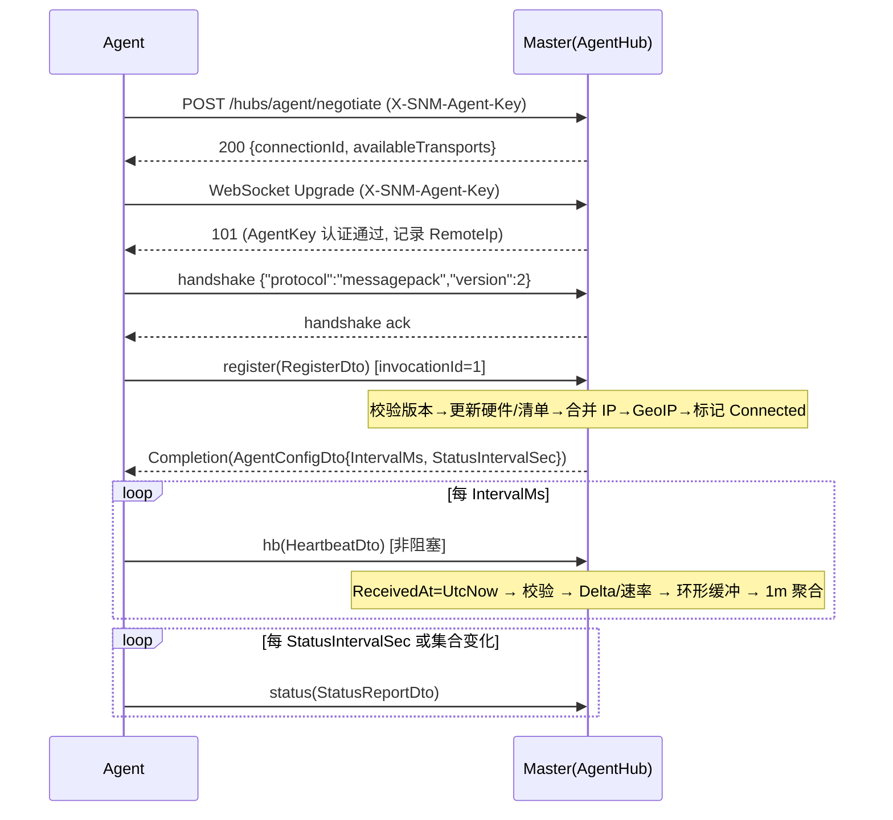
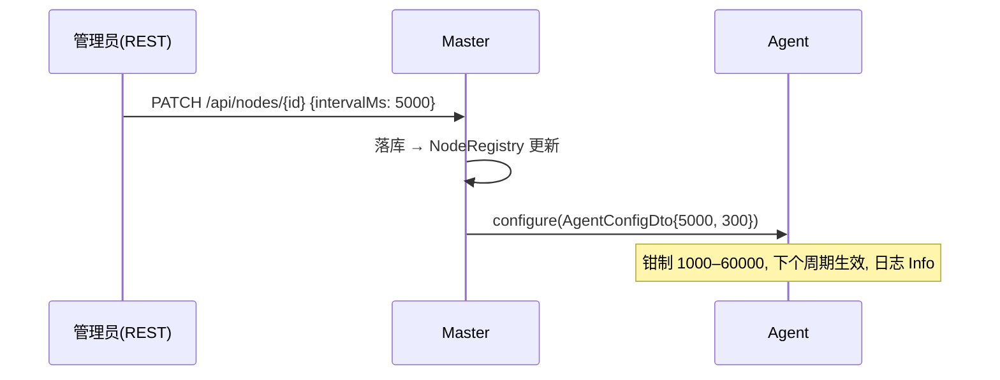

# PROTOCOL — 线协议、Hub 契约与探针内部规范(候选方案 A)

> 本文是 Agent ⇄ Master ⇄ 浏览器之间**唯一的接口契约**。实现者不得自行更改任何 wire 名、Key 索引、类型、单位;需要变更时先改本文再改代码。文中 C# 代码草案(附录 A)可直接落到 `src/SNM.Contracts`。
>
> 术语:**Agent** = 探针(Native AOT 控制台程序);**Master** = ASP.NET Core 服务端;**Admin** = 管理后台 SPA;**Public** = 公开大屏静态页。

---

## 0. 单位与基本约定(全文通用)

| 量 | 线上类型 | 单位 / 取值 | 说明 |
|---|---|---|---|
| CPU 使用率 | `ushort` | 千分比 ‰,0–1000 | 237 = 23.7% |
| 内存 / Swap | `uint` | MiB(1 MiB = 1 048 576 B) | 向下取整 |
| 磁盘容量 | `uint` | MiB | 单挂载点 ≤ 4 PiB |
| 网卡累计流量 | `ulong` | 字节 | 自系统启动以来的累计值(计数器),**不是增量** |
| 网速 | `ulong` | 字节/秒 | 仅 Master → 浏览器方向出现,Master 计算 |
| 负载 | `ushort` | loadavg × 100 | 45 = 0.45;Windows 恒为 0 |
| 时间间隔 | `uint`/`ushort` | 毫秒或秒(字段名后缀 `Ms`/`Sec`) | PRD 要求 TimeSpan → 整数 |
| 时间点 | `long` | Unix 毫秒 UTC | **只出现在 Master → 浏览器**;Agent 上行 DTO 永不携带时间点 |
| 节点状态 | `byte` | 0 Unknown / 1 Online / 2 Offline | `NodeStatus` 常量 |
| 国家码 | `string` | ISO 3166-1 alpha-2 大写,未知为 `""` | 前端转国旗 Emoji |

DTO 里**禁止**出现:`enum`(官方 Hub 协议会把 enum 写成字符串,与静态 formatter 不一致)、`DateTime`/`DateTimeOffset`/`TimeSpan`、`Nullable<T>` 值类型、`Dictionary`、`decimal`、`float/double`(避免浮点跨语言差异;需要小数用整数缩放)。

---

## 1. 设计阶段问题定案(BRIEF §3 与本文相关部分)

| # | 问题 | 定案 | 理由 |
|---|---|---|---|
| Q1 | MessagePack + Native AOT 路径 | **方案 1:在 `SNM.Contracts` 中 vendoring MIT 许可的 `MessagePackHubProtocolWorker` 及依赖,派生 `StaticMessagePackHubProtocolWorker`(类型 switch + 手写静态 formatter),实现 `SnmMessagePackHubProtocol : IHubProtocol`(Name=`messagepack`,Version=2)。Agent 用它替换默认 `JsonHubProtocol`;Master 与浏览器继续用官方包。** 本机实证:分析器 0 警告、ILC 0 IL 警告、帧字节与官方协议逐字节相同(§2.2) | 官方 `AddMessagePackProtocol()` 带 `RequiresUnreferencedCode`;方案 2 的运行时行为本机无法验证。方案 1 没有任何反射/动态代码,`TrimmerSingleWarn=false` 下 ILC 输出 0 警告,可作为 CI 门禁 |
| Q2 | 心跳/注册 DTO | 心跳 `HeartbeatDto` 9 字段、int Key 数组形式,典型 **36 B**(单盘),SignalR 帧 **46 B**;注册 `RegisterDto` 16 字段(≈209 B,每连接一次);IP/挂载盘清单走 `StatusReportDto`(每 300 s 或变化时);服务端打时间戳 | 见 §4.4 实测表 |
| Q7 | 实时推送形状 | Public/Admin Hub:连接后 `snapshot`(含每节点最近 60 点环形缓冲),之后每 **2 s** 一次 `batch`(仅包含本周期有变化的节点),节点元数据变化推 `nodes`/`nodesChanged`;浏览器 DTO 用 **string Key(map)** | 自描述、JS 端零索引常量;带宽仍很小(每节点 ≈ 70–90 B / 2 s) |
| Q8 | Agent 采集与网络 | Linux 直接解析 `/proc`+`/sys`,磁盘容量用 `DriveInfo`(内部 `statvfs`);Windows 用 `LibraryImport` 调 `GetSystemTimes`/`GlobalMemoryStatusEx`/`GetIfTable2`/`GetLogicalProcessorInformationEx` + 注册表;IP 发现两端统一用 `System.Net.NetworkInformation`;`--proxy` 同时作用于 HTTP 与 WebSocket(已从客户端 IL 证实 `WebSocketsTransport.DefaultWebSocketFactory` 会把 `HttpConnectionOptions.Proxy` 赋给 `ClientWebSocketOptions.Proxy`);传输 WebSockets → LongPolling 回退;指数退避永不放弃 | 见 §7 |

其余问题(Q3–Q6、Q9、Q10)在 `DATA.md`、`API.md`、`DEPLOY.md`、`DESIGN.md` 定案。

---

## 2. MessagePack + Native AOT 实现路径(Q1 详述)

### 2.1 结论

`SNM.Contracts`(`IsAotCompatible=true`)包含三层:

1. **DTO**:`[MessagePackObject]` + `[Key(n)]`(Agent 上行)或 `[Key("name")]`(浏览器方向)的 POCO。Master 侧官方协议用反射 resolver 读写它们;JS 侧 `@msgpack/msgpack` 把 int-Key 数组解成数组、string-Key 解成对象。
2. **静态 formatter**(`SNM.Contracts.Formatters`):每个 Agent 上行/下行 DTO 一对 `Write(ref MessagePackWriter, T)` / `Read(ref MessagePackReader)` 静态方法,只调用 `MessagePackWriter.Write(...)` / `MessagePackReader.ReadXxx()` / `Skip()`。**不实现 `IMessagePackFormatter<T>`,签名中不出现 `MessagePackSerializerOptions`**(该类型的静态字段初始化会 root `StandardResolver` → 动态 resolver 链)。
3. **Hub 协议**(`SNM.Contracts.Protocol`):
   - vendored(MIT,dotnet/aspnetcore `release/10.0`,已放在 `spikes/aot-messagepack/upstream-reference/`,原样拷贝、保留许可头):`MessagePackHubProtocolWorker.cs`、`BinaryMessageParser.cs`、`BinaryMessageFormatter.cs`、`MemoryBufferWriter.cs`;补一个 15 行的 `ProtocolHelper.TryGetReturnType`(等价于 upstream 共享文件 `TryGetReturnType.cs`)。
   - 新增 `StaticMessagePackHubProtocolWorker : MessagePackHubProtocolWorker`:重写 `Serialize(ref writer, Type, object)` 为 `switch (value)` 模式匹配,重写 `DeserializeObject(ref reader, Type, field)` 为 `if (type == typeof(X))` 链;未知类型抛 `InvalidDataException`。
   - 新增 `SnmMessagePackHubProtocol : IHubProtocol`:`Name = "messagepack"`,`Version = 2`,`TransferFormat.Binary`,`IsVersionSupported(v) => v <= 2`。握手 JSON `{"protocol":"messagepack","version":2}` 由 `HubConnection` 按 Name/Version 生成,服务端官方协议直接接受。

Agent 注册方式(`SNM.Agent`):

```csharp
builder.Services.Replace(ServiceDescriptor.Singleton<IHubProtocol, SnmMessagePackHubProtocol>());
```

`HubConnectionBuilder` 构造时默认注册了 `JsonHubProtocol`(已用反射枚举 DI 描述符证实),必须 **Replace** 而不是 Add。

### 2.2 本机实证(2026-09-07,SDK 10.0.400,包 10.0.11 / MessagePack 2.5.302,win-arm64 ILC)

| 检查项 | 结果 |
|---|---|
| `dotnet build -c Release`(`IsAotCompatible` + Trim/AOT/SingleFile 分析器) | **0 警告 0 错误** |
| JIT 运行:`SnmMessagePackHubProtocol.GetMessageBytes(InvocationMessage("hb",[dto]))` | 46 B,`2D 96 01 80 C0 A26862 91 <dto 36B> 90` |
| 官方 `MessagePackHubProtocol` 对同一消息的输出 | **逐字节相同** |
| 手写 formatter vs `MessagePackSerializer.Serialize(dto, Standard)`(4 组边界值) | **全部 SequenceEqual**;双向反序列化字段一致 |
| `CompletionMessage.WithResult("1", AgentConfigDto)` 自写自读 | 通过 |
| `dotnet publish -r win-arm64 -p:PublishAot=true -p:IlcUseEnvironmentalTools=true -p:TrimmerSingleWarn=false` | ILC 完成 `Generating native code`,产出 `snm-aot.obj`(38.9 MB 未链接);`warning IL` 计数 **0**;仅 `link` 步骤失败(预期,无 MSVC) |
| 构建中包含的代码路径 | `HubConnectionBuilder.WithUrl(WebSockets\|LongPolling, Headers, Proxy=WebProxy(socks5://), WebSocketConfiguration)`、`Replace(IHubProtocol)`、`On<AgentConfigDto>`、`StartAsync`、`InvokeAsync<AgentConfigDto>`、`SendAsync` |

该实验工程可由实现者按附录 A 一比一重建;CI 中的 Agent 门禁沿用同一命令(`deploy/.github/workflows/agent-aot.yml`,见 DEPLOY.md)。

### 2.3 Agent 侧硬性规则(违反任一条都会重新引入 IL2xxx/IL3xxx)

1. 不得引用:`MessagePackSerializer`(任何重载)、`MessagePackSerializerOptions`(**包括 `new`、`.Standard`、任何静态成员**)、`StandardResolver`/`ContractlessStandardResolver`/`StaticCompositeResolver`/`IFormatterResolver.GetFormatter<T>()`、`MessagePackSecurity`、`FormatterResolverExtensions`、`[MessagePackFormatter]`、`MessagePackSerializer.Typeless`。
2. 只允许:`MessagePackWriter`、`MessagePackReader`、`MessagePackCode`、`MessagePackType`,以及 `SNM.Contracts.Formatters.*` 静态方法。
3. 不得使用 `System.Text.Json` 反射序列化(`JsonSerializer.Serialize(object)`);Agent 不需要 JSON。若日后需要,用 `JsonSerializerContext` 源生成。
4. 不得使用 `Microsoft.Extensions.Logging.Console`/`Configuration.Binder`/`Hosting`;Agent 自带 60 行的 `SimpleConsoleLoggerProvider`,配置解析手写。
5. `UnconditionalSuppressMessage`:**当前为零**。若未来包升级在**我们自己的代码**引入告警,允许在 `SNM.Agent`/`SNM.Contracts` 使用 suppress,但必须:(a) 只针对具体方法;(b) `Justification` 写明为何该路径在运行时不会触达动态代码;(c) 在 `PROTOCOL.md` §2.3 登记。来自第三方 dll 内部的 ILC 警告一律视为失败,回到规则 1 排查 rooting 路径(`dotnet publish ... -p:IlcVerboseLogging=true`,或 `--singlewarn` 关闭后按警告的调用链回溯)。

### 2.4 互通性证明(JIT,`tests/SNM.Contracts.Tests`)

| 测试类 | 断言 |
|---|---|
| `ByteEquivalenceTests` | 对每个 Agent 上行/下行 DTO,构造 ≥ 4 组值(最小/典型/最大/含 null 数组),`Static.Write` 字节 == `MessagePackSerializer.Serialize(dto, MessagePackSerializerOptions.Standard)`;并交叉反序列化(官方字节 → 静态 Read;静态字节 → 官方 Deserialize)字段逐一相等 |
| `FrameCompatibilityTests` | `SnmMessagePackHubProtocol` 与官方 `MessagePackHubProtocol` 对 `InvocationMessage`(阻塞/非阻塞)、`CompletionMessage`(Void/Result/Error)、`PingMessage`、`CloseMessage` 的 `GetMessageBytes` 逐字节相同;互相 `TryParseMessage` 成功且字段相同;多帧粘包(两条消息拼接)与半包(截断)行为一致 |
| `ForwardCompatibilityTests` | 数组多一个元素 → 静态 Read 跳过;少一个元素 → 缺省值;nil → null;`Cpu=1000`、`ulong.MaxValue`、空字符串、64 个字符的 UTF-8 中文字符串 |
| `ResolverRulesTests` | 反射断言 `SNM.Contracts` 与 `SNM.Agent` 程序集**不引用**规则 1 列出的类型/成员(读取 `MemberReferences`,用 `System.Reflection.Metadata`) |

`tests/SNM.Master.Tests/AgentHubIntegrationTests`:`WebApplicationFactory` 起 Master(官方协议),用**与 Agent 完全相同的连接构造代码**(`SnmMessagePackHubProtocol`)连 `/hubs/agent`,`register` 得到 `AgentConfigDto`,发 3 次 `hb`,断言内存快照与数据库 `TrafficState` 正确。

### 2.5 为什么不选方案 2 / 3

- 方案 2(官方协议包 + `StaticCompositeResolver` + 泛型 rooting + suppress):官方 worker 内部对参数走 `MessagePackSerializer.Serialize(Type, ...)` 非泛型入口 → `MakeGenericMethod` + `Expression.Compile`(byref 参数),AOT 下依赖解释器;本机没有链接器,运行时行为不可验证;且 ~60 条 ILC 警告只能靠 `TrimmerSingleWarn` 掩盖,与验收口径(0 警告)冲突。
- 方案 3(自研 JSON 或自定义二进制协议):失去 MessagePack 与浏览器/官方包互通,违背 BRIEF 锁定的"三 Hub 均 MessagePack"。

---

## 3. 通用编码约定

### 3.1 Agent 上行/下行 DTO(int Key,数组形式)

- Key 必须从 0 连续编号;`WriteArrayHeader(n)` 中 n = 字段数。新增字段只能追加在末尾;删除字段改为保留位(写 `nil`),永不复用索引。
- 读端规则(静态 formatter 与官方 `DynamicObjectResolver` 一致):读到的元素数 > 已知字段数 → 多余元素 `Skip()`;< 已知字段数 → 缺失字段保持默认值;对象位置为 `nil` → `null`。
- 数组字段:`null` 写 `nil`;元素上限 `ProtocolConstants.MaxDisks=16`、`MaxIps=16`;静态 Read 对任何数组头 > 256 抛 `InvalidDataException`(防御异常服务端)。
- 字符串:UTF-8;发送前截断到 `MaxStringChars=256` 个字符;`null` 一律用 `""`(DTO 属性初始化为 `""`,序列化不会出现 nil 字符串)。
- 整数编码:`MessagePackWriter.Write(ushort/uint/ulong)` 自动选择最短正整数编码(见下表),两端一致,因此**字段类型不影响线上字节,只影响取值上限**。

| 值域 | 编码 | 字节数 |
|---|---|---|
| 0–127 | positive fixint | 1 |
| 128–255 | uint8 | 2 |
| 256–65 535 | uint16 | 3 |
| 65 536–4 294 967 295 | uint32 | 5 |
| ≥ 2^32 | uint64 | 9 |
| 数组 ≤ 15 元素 | fixarray | 1 |
| 字符串 ≤ 31 B | fixstr | 1 + len |
| 字符串 32–255 B | str8 | 2 + len |

### 3.2 浏览器方向 DTO(string Key,map 形式)

- `[MessagePackObject]` + 每个成员 `[Key("camelCase")]`,官方 resolver 输出 map,JS 端得到普通对象。
- 键名是契约的一部分(表中列出),只增不改。
- 数组字段允许 `null`(JS 端得到 `null`)。

### 3.3 时间戳

- Master 在 Hub 方法入口取 `DateTime.UtcNow` 作为该消息的唯一时间(`ReceivedAt`)。所有落库、推送的时间都来自它。
- Agent 只上报**相对**时间(`ElapsedMs`、`UptimeSec`)。

### 3.4 版本

- `ProtocolConstants.ProtocolVersion = 1`,随 `RegisterDto.ProtocolVersion` 上报。Master 只接受相同主版本;不匹配 → `register` 返回错误(见 §4.7)。
- Hub 协议名/版本固定 `messagepack`/2(与官方一致)。

---

## 4. Agent Hub `/hubs/agent`

### 4.1 连接与鉴权

| 项 | 规定 |
|---|---|
| URL | `{server}/hubs/agent`(`--server` 只填 origin,如 `https://m.example.com`,Agent 拼接路径) |
| 传输 | 默认 `WebSockets \| LongPolling`(需要 negotiate);`--transport websockets` 时 `SkipNegotiation=true`(少一次 POST,但无回退);SSE 不可用(二进制协议) |
| 鉴权 | HTTP 头 `X-SNM-Agent-Key: snmk_<43 个 base64url 字符>`,随 negotiate、WebSocket 握手、LongPolling 每个请求发送(.NET 客户端 `HttpConnectionOptions.Headers`)。备用:查询参数 `access_token=`(仅用于 curl/浏览器调试,Agent 不使用) |
| Master 侧方案 | 自定义 `AuthenticationHandler`,scheme 名 `AgentKey`:格式校验(前缀 + 长度 48)→ 内存字典 `agentKey → nodeId`(由 `NodeRegistry` 维护,节点增删改/轮换时刷新)→ 成功则 Claims:`NameIdentifier=nodeId`、`role=agent`;失败/禁用节点 → 401(响应体空);Hub 上 `[Authorize(AuthenticationSchemes="AgentKey")]` |
| 其他请求头 | `User-Agent: snm-agent/<version> (<os>; <arch>)` |
| SignalR 超时 | Agent:`ServerTimeout=45s`、`KeepAliveInterval=15s`、`HandshakeTimeout=15s`;Master:`ClientTimeoutInterval=45s`、`KeepAliveInterval=15s`、`HandshakeTimeout=15s`、`MaximumReceiveMessageSize=65536`、`MaximumParallelInvocationsPerClient=1` |
| 远程 IP | Master 在 `OnConnectedAsync` 读取 `Context.GetHttpContext().Connection.RemoteIpAddress`(已经过 `ForwardedHeaders` 中间件,仅信任 loopback 与配置的 `KnownProxies`),记为 `LastRemoteIp`,并入 IP 合并(§4.6) |
| 同 Key 并发 | 新连接一律接受;旧连接立即 `Abort()`(最新者胜,详见时序图 4.5.4) |

### 4.2 方法一览

| 方向 | wire 名 | C# 常量 | 载荷 → 返回 | 调用方式 | 频率 |
|---|---|---|---|---|---|
| Agent→Master | `register` | `AgentHubMethods.Register` | `RegisterDto` → `AgentConfigDto` | `InvokeAsync<AgentConfigDto>`(超时 15 s) | 每次连接建立后立即 1 次;同连接内重发视为更新 |
| Agent→Master | `hb` | `AgentHubMethods.Heartbeat` | `HeartbeatDto` → 无 | `SendAsync`(不等待完成) | 每 `IntervalMs`(默认 2000) |
| Agent→Master | `status` | `AgentHubMethods.ReportStatus` | `StatusReportDto` → 无 | `SendAsync` | 每 `StatusIntervalSec`(默认 300)+ IP 集合/挂载集合变化时立即 |
| Master→Agent | `configure` | `AgentHubMethods.Configure` | `AgentConfigDto` | `Clients.Client(connectionId).SendAsync` | 管理员修改节点间隔或全局默认时 |

Master 端 Hub 方法用 `[HubMethodName("register")]` 等显式绑定 wire 名;`configure` 用 `SendAsync(AgentHubMethods.Configure, cfg)` 发送;Agent 用 `On<AgentConfigDto>(AgentHubMethods.Configure, ...)` 订阅。**下行消息全集 = {`configure`, `register` 的返回值}**,再无其他;Agent 忽略任何未知 target(SignalR 客户端默认行为:无处理器则丢弃并打 Warning 日志)。

### 4.3 DTO 定义

#### 4.3.1 `RegisterDto`(Agent → Master,`register` 参数)

| Key | 字段 | C# 类型 | 单位 / 取值 | 含义与采集规则 |
|---|---|---|---|---|
| 0 | `ProtocolVersion` | `ushort` | 固定 1 | 见 §3.4 |
| 1 | `AgentVersion` | `string` | 如 `1.0.0+3f2a9c1` | `AssemblyInformationalVersion` |
| 2 | `Hostname` | `string` | ≤ 64 字符 | `Environment.MachineName`;`--name` 覆盖 |
| 3 | `Os` | `string` | 如 `Ubuntu 22.04.4 LTS` / `Windows Server 2022 Datacenter 21H2 (build 20348.2461)` | Linux `/etc/os-release` `PRETTY_NAME`;Windows 注册表(§7.4) |
| 4 | `Kernel` | `string` | 如 `5.15.0-113-generic` / `10.0.20348.2461` | Linux `/proc/sys/kernel/osrelease`;Windows `Environment.OSVersion.Version` + UBR |
| 5 | `Arch` | `string` | `x64` / `arm64` / `x86` / `arm` | `RuntimeInformation.OSArchitecture` 小写 |
| 6 | `CpuModel` | `string` | 如 `2x Intel(R) Xeon(R) Gold 6148 CPU @ 2.40GHz` | 插槽数 ≥ 2 时加 `Nx ` 前缀(§7.3/§7.4) |
| 7 | `CpuCores` | `ushort` | 逻辑核心数 | Linux 数 `/proc/cpuinfo` 的 `processor` 行,回退 `Environment.ProcessorCount` |
| 8 | `MemTotalMb` | `uint` | MiB | `MemTotal` / `ullTotalPhys` |
| 9 | `SwapTotalMb` | `uint` | MiB | `SwapTotal` / `max(0, ullTotalPageFile − ullTotalPhys)` |
| 10 | `Disks` | `DiskInfoDto[]` | ≤ 16 项,`/`(或系统盘)排第一,其余按挂载点字典序 | 磁盘清单;**其顺序定义了 `HeartbeatDto.DiskUsedMb` 的索引** |
| 11 | `Ips` | `string[]` | ≤ 16 项 | 过滤后的本机地址(§7.6),IPv4 在前 |
| 12 | `UptimeSec` | `uint` | 秒 | `/proc/uptime` / `Environment.TickCount64/1000`;Master 据此算 `BootTimeUtc = now − UptimeSec` |
| 13 | `Virt` | `string` | `kvm` / `vmware` / `hyperv` / `xen` / `virtualbox` / `lxc` / `docker` / `openvz` / `""` | 尽力识别(§7.3),Windows 恒 `""` |
| 14 | `IntervalMs` | `ushort` | 1000–60000 | Agent 当前生效的心跳间隔(CLI/环境变量值);Master 返回值可覆盖 |
| 15 | `NetIfs` | `string` | 逗号分隔,≤ 256 字符,如 `eth0,ens3` | 被计入流量的网卡名(诊断用) |

#### 4.3.2 `DiskInfoDto`

| Key | 字段 | C# 类型 | 含义 |
|---|---|---|---|
| 0 | `Mount` | `string` | 挂载点(Linux 路径 / Windows `C:\`) |
| 1 | `Fs` | `string` | 文件系统类型(`ext4`/`xfs`/`NTFS`…) |
| 2 | `TotalMb` | `uint` | 总容量 MiB(`DriveInfo.TotalSize / MiB`) |

#### 4.3.3 `HeartbeatDto`(Agent → Master,`hb` 参数)

| Key | 字段 | C# 类型 | 单位 / 取值 | 含义与规则 |
|---|---|---|---|---|
| 0 | `Seq` | `uint` | 本连接内从 1 自增 | 去重/乱序判定;连接重建后重新从 1 开始 |
| 1 | `ElapsedMs` | `uint` | 毫秒 | 本次与上次**计数器采样**之间的单调时钟间隔(`Stopwatch`),Master 用它算网速;本连接第一包无上次样本时为 0 |
| 2 | `Cpu` | `ushort` | ‰ 0–1000 | 两次 `/proc/stat`(或 `GetSystemTimes`)差分:`round(1000 × Δbusy / Δtotal)` |
| 3 | `MemUsedMb` | `uint` | MiB | `MemTotal − MemAvailable`(Windows `ullTotalPhys − ullAvailPhys`) |
| 4 | `SwapUsedMb` | `uint` | MiB | `SwapTotal − SwapFree`(Windows:`max(0,(TotalPageFile−AvailPageFile)−(TotalPhys−AvailPhys))`) |
| 5 | `DiskUsedMb` | `uint[]` | MiB,每个元素 = `(TotalSize − TotalFreeSpace)/MiB` | 与最近一次 `register`/`status` 的 `Disks` **按索引对齐**;Agent 每次心跳先比较挂载集合,若变化则**先发 `status` 再发 `hb`** |
| 6 | `NetRxBytes` | `ulong` | 字节 | 计入网卡(§7.5)的 `rx_bytes` 之和(累计计数器) |
| 7 | `NetTxBytes` | `ulong` | 字节 | 同上 `tx_bytes` |
| 8 | `Load1` | `ushort` | loadavg × 100,上限 65535 | Linux `/proc/loadavg` 第一列;Windows 0 |

#### 4.3.4 `StatusReportDto`(Agent → Master,`status` 参数)

| Key | 字段 | C# 类型 | 含义 |
|---|---|---|---|
| 0 | `Ips` | `string[]` | 同 `RegisterDto.Ips`,全量替换 |
| 1 | `Disks` | `DiskInfoDto[]` | 全量磁盘清单(重新定义心跳索引) |
| 2 | `UptimeSec` | `uint` | 秒 |
| 3 | `ProcCount` | `ushort` | 进程数(Linux 数 `/proc` 数字目录;Windows `Process.GetProcesses().Length`) |
| 4 | `NetIfs` | `string` | 当前计入的网卡名 |
| 5 | `MemTotalMb` | `uint` | 便于热插拔场景更新 |

#### 4.3.5 `AgentConfigDto`(Master → Agent,`register` 返回值与 `configure` 载荷)

| Key | 字段 | C# 类型 | 取值 | 含义 |
|---|---|---|---|---|
| 0 | `IntervalMs` | `ushort` | 1000–60000,默认 2000 | 心跳间隔;Agent 收到后**下一周期**生效(重建 `PeriodicTimer`) |
| 1 | `StatusIntervalSec` | `ushort` | 60–3600,默认 300 | `status` 上报间隔 |

Agent 对越界值钳制到区间,不报错。

### 4.4 字节预算(实测,MessagePack 2.5.302 + 官方协议 10.0.11)

| 场景 | DTO 字节 | SignalR 帧(target `hb`) | 说明 |
|---|---|---|---|
| 典型:Seq 1234、2001 ms、CPU 23.7%、内存 1843 MiB、Swap 0、1 盘 18 GiB 已用、Rx 523 GB、Tx 98 GB、load 0.45 | **36** | **46** | 帧 = 1 B 长度前缀 + `96 01 80 C0` + `A2 6862` + `91` + DTO + `90` = DTO + 10 |
| 高负载 2 盘、内存 30 GiB、Rx 5.2 TB | 48 | 58 | |
| 刚开机小机器(Rx < 4 GiB → uint32) | 22 | 32 | |
| 极限:4 盘、内存 1 TiB、计数器 `ulong.MaxValue` | 64 | 74 | 理论上限 |
| `RegisterDto` 典型值 | 209 | 222 | 每连接一次 |
| `AgentConfigDto` 完成消息 | 5 | ≈ 12 | |
| SignalR Ping | 2 | 3 | 每 15 s |

WebSocket 层再加 2–8 B 帧头(客户端→服务端含 4 B 掩码,共 6 B)。心跳 DTO 满足 PRD"50 B 内";若把 target 改为 `Heartbeat`,帧增大 7 B(53 B),故 wire 名取 `hb`。

### 4.5 时序图

#### 4.5.1 首次连接与注册



#### 4.5.2 心跳周期内 Agent 的动作顺序

1. 采样 `/proc/stat`、`/proc/meminfo`、`/proc/loadavg`、`/proc/net/dev`(或 Win32 等价物),记录 `Stopwatch` 时刻 → `ElapsedMs`。
2. 读取 `/proc/mounts` 得到挂载集合;与上次已发送清单比较(挂载点 + 文件系统 + 总容量三元组);不同 → 先 `SendAsync("status", ...)`(同步等待发送完成)。
3. 每个挂载点 `new DriveInfo(mount)` 取 `TotalSize`/`TotalFreeSpace`。
4. 组装 `HeartbeatDto`,`Seq++`,`SendAsync("hb", dto)`(5 s 超时;失败 → 视为断线,进入 §7.9 重连)。

#### 4.5.3 断线重连

```mermaid
sequenceDiagram
    participant A as Agent
    participant M as Master
    A-xM: 连接中断 (Closed 事件 / SendAsync 抛异常)
    Note over A: 退避 1s,2s,4s,…,60s(±20% 抖动), 401/403 固定 60s
    A->>M: negotiate + WebSocket (新 connectionId)
    A->>M: register(RegisterDto)  ← Seq 重新从 1 开始
    M-->>A: AgentConfigDto
    A->>M: hb(Seq=1, ElapsedMs=~interval)
    Note over M: 首包速率用服务端时间差; 计数器 Delta 照常累计 (见 DATA.md §4)
```

#### 4.5.4 同一 Key 的并发连接(抢占)

```mermaid
sequenceDiagram
    participant A1 as 旧连接 A1
    participant A2 as 新连接 A2
    participant M as Master
    A2->>M: register
    Note over M: registry[node].ConnectionId = A2; 调用 A1 的 HubCallerContext.Abort()
    M-->>A2: AgentConfigDto
    M-xA1: 连接被服务端关闭 (Close, allowReconnect=false)
    A1->>M: hb (若仍在飞行) → 丢弃并记录 Warning(connectionId 不匹配)
```

#### 4.5.5 配置下发



### 4.6 Master 侧处理规则(逐条,实现者照做)

**R1 时间戳**:每个 Hub 方法第一行 `var now = DateTime.UtcNow;`,后续全部使用该值。

**R2 连接归属**:`NodeRegistry[nodeId].ConnectionId` 必须等于 `Context.ConnectionId`,否则该消息丢弃(`Warning: stale connection`)并 `Context.Abort()`。`register` 例外:它设置归属并抢占。

**R3 顺序与重复**:同一连接内 `hb.Seq` 必须严格递增;`Seq <= lastSeq` → 丢弃(`Debug` 日志,计数器 `snm_hb_dropped_total{reason="seq"}`)。`Seq` 允许跳跃(Agent 发送失败会跳号)。SignalR 单连接内消息有序,因此乱序只会出现在 Agent 缺陷或旧连接残留场景。

**R4 注册前心跳**:连接上尚未 `register` 就收到 `hb`/`status` → 丢弃,每连接只记 1 条 Warning。

**R5 校验与钳制**(不向 Agent 抛错,除 `register` 版本不符外):`Cpu` > 1000 → 1000;`DiskUsedMb.Length != Inventory.Length` → 忽略磁盘部分并置 `InventoryMismatch=true`(下一次 `status` 修正);字符串按 256 字符截断;`Ips` 中无法 `IPAddress.TryParse` 的项丢弃;`Disks`/`Ips` 超过 16 项截断;`IntervalMs` 钳制。

**R6 心跳落地**(全部在内存,不写库):更新 `LastSeenAt=now`、`Status=Online`(若之前不是则标记 dirty + `StatusChangedAt`)、最新值快照、网速与 Delta(DATA.md §4)、环形缓冲追加 `(now, cpu, mem‰, rxBps, txBps)`、1 分钟聚合桶累加(DATA.md §3)、置 `Dirty=true` 供广播器使用。

**R7 注册落地**(写库,单事务):更新硬件字段、`DisksJson`、`NetIfs`、`AgentVersion`、`ProtocolVersion`、`BootTimeUtc=now−UptimeSec`、`LastRegisterAt`、`LastRemoteIp`;IP 合并(R8);GeoIP 查 `LastRemoteIp` 写 `CountryCodeAuto`(覆盖值优先仅在展示时决定);发布 `nodesChanged` 到 Admin Hub、必要时 `nodes` 到 Public Hub(名称/国家变化才会)。

**R8 IP 合并**:集合 = Agent 上报 `Ips` ∪ {服务端 `RemoteIp`}(RemoteIp 若是 loopback/私网——例如 Master 与 Agent 同机或内网部署——仍记录但 `IsPublic=false`)。每个地址 upsert 到 `NodeIps`(`Source`:1 agent / 2 server / 3 both,`LastSeenAt=now`);同一节点 24 h 未再出现的地址删除(由 `status` 上报时的集合差与每日清理任务完成)。公网判定:非 RFC1918/100.64/10(CGNAT)/127/169.254/fc00::/7/fe80::/10/::1。

**R9 在线/离线**:`RealtimeBroadcaster` 每 2 s 扫描:`Status==Online && now−LastSeenAt > OfflineTimeoutSec(30)` → `Status=Offline`、dirty。任何 `hb`/`status`/`register` → `Online`。`OnDisconnectedAsync` 只清 `Connected=false` 与 `ConnectionId`,**不**直接置 Offline(避免快速重连抖动)。

**R10 状态上报落地**:`Ips` 走 R8;`Disks` 替换清单(写 `DisksJson`)并清 `InventoryMismatch`;`UptimeSec` 更新 `BootTimeUtc`(差异 > 120 s 视为重启,通知流量引擎,见 DATA.md §4.3);`ProcCount`、`MemTotalMb`、`NetIfs` 更新。

### 4.7 错误处理

| 场景 | Master 行为 | Agent 行为 |
|---|---|---|
| Key 格式错误 / 不存在 / 节点禁用 | negotiate 或握手返回 **401**;日志 Warning 含远程 IP(不含 Key) | 日志 `Error: authentication rejected (HTTP 401) – check --key / node enabled`;固定 60 s 后重试,永不放弃 |
| `register` 版本不符 | 抛 `HubException("unsupported protocol version {v}; server supports 1")` → Completion(error) | 日志 Error;10 min 后重连重试(可能服务端会升级) |
| `register` 参数反序列化失败 | SignalR 返回 `InvocationBindingFailureMessage` → Completion error | 同上处理为致命,10 min 重试 |
| `hb`/`status` 反序列化失败 | 服务端记录 Warning、忽略;若 1 分钟内 > 10 次 → `Abort()` 连接 | 被断开 → 正常重连 |
| Master 重启 | 所有连接断开 | 退避重连 → `register` → 继续;流量基线来自 DB(DATA.md §4) |
| 心跳发送超时(5 s) | — | 视为断线:`DisposeAsync` 当前连接,进入重连 |
| `configure` 非法值 | — | 钳制并 Warning |
| Agent 采集器异常(某文件读失败) | — | 该字段用上次值/0,日志每 5 min 最多 1 条;不中断心跳 |

---

## 5. Public Hub `/hubs/public`

### 5.1 连接

- 匿名,无鉴权;`MaximumReceiveMessageSize=1024`;传输 WebSockets → LongPolling(JS 客户端自动跳过 SSE)。
- 浏览器:`new signalR.HubConnectionBuilder().withUrl('/hubs/public').withHubProtocol(new signalR.protocols.msgpack.MessagePackHubProtocol()).withAutomaticReconnect([0,2000,5000,10000,30000,60000])`(自定义重试序列末尾 60 s 循环:实现 `IRetryPolicy` 恒返 60000)。`onreconnected` → `invoke('GetSnapshot')` 重同步。
- Master 侧 `OnConnectedAsync` 主动向 `Caller` 发送 `snapshot`,客户端**不需要**先调用任何方法。

### 5.2 方法一览

| 方向 | wire 名 | 载荷 | 时机 |
|---|---|---|---|
| Master→浏览器 | `snapshot` | `PublicSnapshotDto` | 连接建立时;客户端 `GetSnapshot` 调用后 |
| Master→浏览器 | `batch` | `PublicBatchDto` | 每 2 s 一次,仅含本周期 dirty 的节点;无 dirty 节点则不发 |
| Master→浏览器 | `nodes` | `PublicNodeDto[]`(`Hist=null`) | 节点增/删/改名/国家/可见性/规格变化时(全量列表) |
| 浏览器→Master | `GetSnapshot` | 无 → `PublicSnapshotDto` | 重连后重同步 |

### 5.3 DTO(string Key)

`PublicSnapshotDto`

| Key | 字段 | 类型 | 含义 |
|---|---|---|---|
| `ts` | `ServerTs` | `long` | 服务端 Unix ms |
| `site` | `Site` | `PublicSiteDto` | 站点信息 |
| `nodes` | `Nodes` | `PublicNodeDto[]` | 仅 `PublicVisible=true` 且 `Enabled=true` 的节点,按 `SortOrder, Id` |

`PublicSiteDto`

| Key | 字段 | 类型 | 含义 |
|---|---|---|---|
| `title` | `Title` | `string` | 设置 `site.publicTitle` |
| `subtitle` | `Subtitle` | `string` | 设置 `site.publicSubtitle` |
| `showSpecs` | `ShowSpecs` | `bool` | 设置 `public.showSpecs` |
| `showTraffic` | `ShowTraffic` | `bool` | 设置 `public.showTraffic` |
| `offlineSec` | `OfflineTimeoutSec` | `int` | 供前端显示"多久未上报" |

`PublicNodeDto`

| Key | 字段 | 类型 | 含义 |
|---|---|---|---|
| `id` | `Id` | `int` | 节点 Id |
| `name` | `Name` | `string` | **PublicName** |
| `cc` | `Cc` | `string` | 国家码(覆盖值优先) |
| `order` | `Order` | `int` | 排序 |
| `cores` | `Cores` | `ushort` | `showSpecs=false` 时为 0 |
| `memMb` | `MemTotalMb` | `uint` | 同上 |
| `diskMb` | `DiskTotalMb` | `ulong` | 所有挂载点总容量之和;同上 |
| `tLimit` | `TrafficLimitBytes` | `ulong` | 0 = 无限制或 `showTraffic=false` |
| `live` | `Live` | `PublicNodeLiveDto` | 当前值 |
| `hist` | `Hist` | `PublicHistoryDto?` | 最近 ≤ 60 点,仅 `snapshot` 携带 |

`PublicNodeLiveDto`

| Key | 字段 | 类型 | 含义 |
|---|---|---|---|
| `id` | `Id` | `int` | |
| `status` | `Status` | `byte` | 0/1/2 |
| `cpu` | `Cpu` | `ushort` | ‰ |
| `mem` | `Mem` | `ushort` | ‰ = `round(1000×MemUsedMb/MemTotalMb)` |
| `disk` | `Disk` | `ushort` | ‰ = `round(1000×ΣUsedMb/ΣTotalMb)` |
| `rx` | `RxBps` | `ulong` | 字节/秒 |
| `tx` | `TxBps` | `ulong` | 字节/秒 |
| `up` | `UptimeSec` | `uint` | `now − BootTimeUtc`;未知 0 |
| `tUsed` | `TrafficUsedBytes` | `ulong` | 本账期计费字节(按 `TrafficCountMode`);`showTraffic=false` 时 0 |
| `ts` | `Ts` | `long` | 最后一次心跳的服务端 Unix ms,从未收到为 0 |

`PublicHistoryDto`(四个数组等长,时间由旧到新,采样间隔 ≈ 节点心跳间隔)

| Key | 字段 | 类型 |
|---|---|---|
| `cpu` | `Cpu` | `ushort[]` |
| `mem` | `Mem` | `ushort[]` |
| `rx` | `Rx` | `ulong[]` |
| `tx` | `Tx` | `ulong[]` |

`PublicBatchDto`

| Key | 字段 | 类型 |
|---|---|---|
| `ts` | `ServerTs` | `long` |
| `items` | `Items` | `PublicNodeLiveDto[]` |

### 5.4 推送节奏与服务端缓冲

- 每节点 `RingBuffer<LivePoint>(capacity=60)`,`LivePoint = (long ts, ushort cpu, ushort mem, ulong rxBps, ulong txBps)`;心跳到达时 append。快照取全部(≤ 60 点)。
- `RealtimeBroadcaster`(`BackgroundService`,`PeriodicTimer(2000 ms)`):收集 `Dirty=true` 的节点 → 生成一份 `PublicBatchDto`(过滤不可见节点)与一份 `AdminBatchDto` → `Clients.All.SendAsync` → 清 dirty。序列化每协议一次,与订阅者数量无关。
- 状态翻转(Online↔Offline)本身置 dirty,因此最晚 2 s 内推送到大屏。

### 5.5 脱敏清单(Public Hub 允许出现的字段全集)

`id, name(PublicName), cc, order, cores, memMb, diskMb, tLimit, status, cpu, mem, disk, rx, tx, up, tUsed, ts, hist.*, site.*`。**禁止**:任何 IP、`Hostname`、`AdminRemark`、`Os/Kernel/CpuModel/Virt/AgentVersion`、供应商/价格/到期、`AgentKey`、`RemoteIp`、挂载点名、网卡名、告警内容。`tests/SNM.Master.Tests/PublicHubSanitizationTests` 用反射断言 `PublicSnapshotDto` 树中不存在上述名字的属性,并在集成测试中对序列化字节做子串搜索(节点的 IP、主机名、备注字符串不得出现)。

---

## 6. Admin Hub `/hubs/admin`

### 6.1 连接与鉴权

- `[Authorize(AuthenticationSchemes = JwtBearerDefaults.AuthenticationScheme, Roles = "admin")]`。
- 浏览器无法为 WebSocket 设头,故 `accessTokenFactory: () => authStore.accessToken` → SignalR 追加 `?access_token=`;Master `JwtBearerEvents.OnMessageReceived`:当 `Request.Path.StartsWithSegments("/hubs")` 且存在 `access_token` 查询参数时 `context.Token = 该值`。
- token 过期时服务端在 `OnConnectedAsync` 之后不会主动断开;前端在刷新 access token 后**重建连接**(见 FRONTEND.md)。

### 6.2 方法一览

| 方向 | wire 名 | 载荷 | 时机 |
|---|---|---|---|
| Master→浏览器 | `snapshot` | `AdminSnapshotDto` | 连接建立时 / `GetSnapshot` 后 |
| Master→浏览器 | `batch` | `AdminBatchDto` | 每 2 s(dirty 节点) |
| Master→浏览器 | `alert` | `AdminAlertDto` | 告警事件创建或恢复时 |
| Master→浏览器 | `nodesChanged` | `int[]`(受影响节点 Id;空数组 = 全部) | 节点元数据/清单/IP 变化时;前端据此重新拉 REST |
| 浏览器→Master | `GetSnapshot` | 无 → `AdminSnapshotDto` | 重连 |
| 浏览器→Master | `GetHistory` | `int nodeId` → `AdminHistoryDto?`(不存在返回 null) | 打开节点详情页时 |

### 6.3 DTO(string Key)

`AdminNodeLiveDto`

| Key | 字段 | 类型 | 含义 |
|---|---|---|---|
| `id` | `Id` | `int` | |
| `status` | `Status` | `byte` | |
| `connected` | `Connected` | `bool` | SignalR 连接是否存活 |
| `cpu` | `Cpu` | `ushort` | ‰ |
| `memUsedMb` | `MemUsedMb` | `uint` | |
| `swapUsedMb` | `SwapUsedMb` | `uint` | |
| `diskUsedMb` | `DiskUsedMb` | `ulong[]` | 与节点 `disks` 清单(REST)对齐 |
| `rx` | `RxBps` | `ulong` | |
| `tx` | `TxBps` | `ulong` | |
| `load1` | `Load1` | `ushort` | |
| `up` | `UptimeSec` | `uint` | |
| `lastSeen` | `LastSeenTs` | `long` | Unix ms,0 = 从未 |
| `remoteIp` | `RemoteIp` | `string` | 服务端捕获的公网 IP |
| `tUsed` | `TrafficUsedBytes` | `ulong` | 本账期计费字节 |
| `tRx` | `TrafficRxBytes` | `ulong` | 本账期入向 |
| `tTx` | `TrafficTxBytes` | `ulong` | 本账期出向 |
| `seq` | `Seq` | `uint` | 最后心跳 Seq(诊断) |

`AdminSnapshotDto { ts:long, nodes:AdminNodeLiveDto[] }`;`AdminBatchDto { ts:long, items:AdminNodeLiveDto[] }`。

`AdminAlertDto`

| Key | 字段 | 类型 | 含义 |
|---|---|---|---|
| `id` | `Id` | `long` | `AlertEvents.Id` |
| `nodeId` | `NodeId` | `int` | 0 = 系统级 |
| `nodeName` | `NodeName` | `string` | PublicName |
| `rule` | `Rule` | `byte` | `AlertRule` 常量 |
| `status` | `Status` | `byte` | 1 Firing / 2 Resolved |
| `severity` | `Severity` | `byte` | 1 info / 2 warning / 3 critical |
| `title` | `Title` | `string` | |
| `message` | `Message` | `string` | |
| `ts` | `Ts` | `long` | 事件时间 Unix ms |

`AdminHistoryDto { id:int, ts:long[], cpu:ushort[], mem:ushort[], rx:ulong[], tx:ulong[] }`(≤ 60 点)。

---

## 7. Agent 内部规范

### 7.1 进程结构

```
Program.Main
 ├─ CliOptions.Parse(args, env)          // 手写解析;错误 → 打印用法, exit 2
 ├─ 子命令: run | test | --version | --help
 ├─ Collectors (OperatingSystem.IsLinux()/IsWindows() 分派, 无反射)
 │    ICpuSampler, IMemorySampler, ILoadSampler, INetSampler, IDiskSampler, ISystemInfo, IIpDiscovery
 ├─ AgentSession.RunForeverAsync(ct)
 │    loop:
 │      conn = BuildConnection()          // §7.8
 │      await conn.StartAsync(15s)
 │      cfg = await conn.InvokeAsync<AgentConfigDto>("register", BuildRegister(), 15s)
 │      Apply(cfg); Seq = 0
 │      并行: HeartbeatLoop(cfg.IntervalMs) / StatusLoop(cfg.StatusIntervalSec) / conn.Closed 等待
 │      任一结束 → DisposeAsync(conn) → Backoff.NextDelay() → continue
 └─ SIGTERM/SIGINT (PosixSignalRegistration + Console.CancelKeyPress) → 取消 → exit 0
```

`test` 子命令:执行一轮全部采集(两次 CPU 采样间隔 1 s),以文本形式打印 `RegisterDto` + `HeartbeatDto` 的每个字段与被计入/排除的网卡、挂载点,不连接服务器;用于现场排障。

### 7.2 CLI 与环境变量

| 参数 | 环境变量 | 默认 | 说明 |
|---|---|---|---|
| `--server <url>` | `SNM_SERVER` | 必填 | Master origin(`https://host[:port]`),末尾 `/` 自动去除;`http://` 允许(内网) |
| `--key <agentKey>` | `SNM_KEY` | 必填 | `snmk_` 开头 48 字符;格式不符 exit 2 |
| `--proxy <url>` | `SNM_PROXY` | 无(使用系统/环境代理) | `http://[user:pass@]host:port`、`socks5://host:port`、`socks4://`、`socks4a://`;`none` = 强制直连 |
| `--interval <ms>` | `SNM_INTERVAL` | 2000 | 1000–60000;服务端返回值优先 |
| `--name <hostname>` | `SNM_NAME` | 机器名 | 覆盖 `RegisterDto.Hostname` |
| `--net-if <a,b>` | `SNM_NET_IF` | 自动过滤 | 显式指定计入流量的网卡名(Windows 用 Alias,如 `Ethernet`);指定后不再应用排除规则 |
| `--disk-include </,/data>` | `SNM_DISK_INCLUDE` | 自动过滤 | 显式挂载点列表 |
| `--transport <auto\|websockets\|longpolling>` | `SNM_TRANSPORT` | `auto` | `websockets` 跳过 negotiate |
| `--insecure` | `SNM_INSECURE=1` | 关 | 接受无效 TLS 证书(自签测试) |
| `--log-level <trace\|debug\|info\|warn\|error>` | `SNM_LOG_LEVEL` | `info` | |
| `--version` | — | — | 打印 `snm-agent 1.0.0+sha (protocol 1)` |
| `--help` | — | — | 用法 |

优先级:CLI > 环境变量。退出码:0 正常/信号退出;2 参数错误;3 平台不支持(非 Linux/Windows)。`run` 在网络错误下**永不退出**。

### 7.3 Linux 采集器(文件 → 字段)

| 文件 | 解析 | 产出 |
|---|---|---|
| `/proc/stat` 第一行 `cpu  u n s i iw irq sirq st …` | `total = u+n+s+i+iw+irq+sirq+st`(不含 guest);`idle = i+iw`;与上次样本差分 | `Cpu = round(1000×(Δtotal−Δidle)/Δtotal)`;Δtotal=0 → 沿用上次 |
| `/proc/meminfo` | 取 `MemTotal`、`MemAvailable`(缺失则 `MemFree+Buffers+Cached+SReclaimable`)、`SwapTotal`、`SwapFree`(kB) | `MemUsedMb=(MemTotal−MemAvailable)/1024` 等 |
| `/proc/loadavg` | 第一列 double | `Load1 = clamp(round(x×100), 0, 65535)` |
| `/proc/net/dev` | 跳过 2 行表头;每行 `name:` 后 16 个数;`rx_bytes`=第 1 个,`tx_bytes`=第 9 个;`name` 去空白 | 对通过 §7.5 过滤的网卡求和 |
| `/proc/mounts` | 每行 `dev mnt fstype opts d p`;挂载点含八进制转义(`\040`)需解码 | 经 §7.7 过滤后的挂载点列表;容量用 `new DriveInfo(mnt)` |
| `/proc/uptime` | 第一列 | `UptimeSec` |
| `/proc/cpuinfo` | `processor` 行数 → 逻辑核;`model name` 首个值 → 型号;`physical id` 去重计数 → 插槽数 N(N≥2 → `"{N}x "` 前缀);ARM 无 `model name` 时依次尝试 `/proc/device-tree/model`(去尾 NUL)、`Hardware:` 行、`"ARM64 CPU (implementer 0x{CPU implementer}, part 0x{CPU part})"` | `CpuModel`、`CpuCores` |
| `/etc/os-release` | `PRETTY_NAME="…"`;缺失回退 `RuntimeInformation.OSDescription` | `Os` |
| `/proc/sys/kernel/osrelease` | 整行 | `Kernel` |
| `/sys/class/dmi/id/sys_vendor`、`product_name`;`/proc/1/cgroup`;`/.dockerenv`;`/proc/vz` | vendor/product 含 `QEMU`/`KVM`/`Standard PC` → `kvm`;`VMware` → `vmware`;`Microsoft Corporation`+`Virtual Machine` → `hyperv`;`Xen` → `xen`;`innotek`/`VirtualBox` → `virtualbox`;cgroup 含 `docker`/`lxc` → 对应;`/proc/vz` 存在且 `/proc/bc` 不存在 → `openvz`;都不满足 → `""` | `Virt` |
| `/proc` 目录 | 数纯数字子目录 | `ProcCount` |

读取方式:`File.ReadAllText`/`File.ReadLines`(procfs 文件小,无需流式);任何 `IOException`/`UnauthorizedAccessException` 记录后使用上次值。

### 7.4 Windows 采集器(`LibraryImport`,`AllowUnsafeBlocks=true`)

```csharp
internal static partial class Kernel32
{
    [LibraryImport("kernel32.dll", SetLastError = true)]
    [return: MarshalAs(UnmanagedType.Bool)]
    internal static partial bool GetSystemTimes(out long idleTime, out long kernelTime, out long userTime); // FILETIME 作 long

    [StructLayout(LayoutKind.Sequential)]
    internal struct MEMORYSTATUSEX { public uint dwLength; public uint dwMemoryLoad; public ulong ullTotalPhys, ullAvailPhys, ullTotalPageFile, ullAvailPageFile, ullTotalVirtual, ullAvailVirtual, ullAvailExtendedVirtual; }

    [LibraryImport("kernel32.dll", SetLastError = true)]
    [return: MarshalAs(UnmanagedType.Bool)]
    internal static partial bool GlobalMemoryStatusEx(ref MEMORYSTATUSEX buffer); // 调用前 dwLength = sizeof

    [LibraryImport("kernel32.dll", SetLastError = true)]
    [return: MarshalAs(UnmanagedType.Bool)]
    internal static unsafe partial bool GetLogicalProcessorInformationEx(int relationship, byte* buffer, ref uint length); // relationship=3 (RelationProcessorPackage)
}
internal static partial class IpHlpApi
{
    [LibraryImport("iphlpapi.dll")] internal static unsafe partial uint GetIfTable2(out MIB_IF_TABLE2* table);
    [LibraryImport("iphlpapi.dll")] internal static unsafe partial void FreeMibTable(MIB_IF_TABLE2* table);
}
```

| 指标 | 方法 |
|---|---|
| CPU | `GetSystemTimes`:`busy = (kernel+user) − idle`(kernel 已含 idle);两次差分 → ‰ |
| 内存/Swap | `GlobalMemoryStatusEx`;`SwapTotalMb = max(0, ullTotalPageFile − ullTotalPhys)/MiB`;`SwapUsedMb = max(0, (ullTotalPageFile−ullAvailPageFile) − (ullTotalPhys−ullAvailPhys))/MiB` |
| 网卡 | `GetIfTable2` → `MIB_IF_TABLE2 { uint NumEntries; (8 字节对齐后) MIB_IF_ROW2 Table[] }`;`MIB_IF_ROW2` 用 `LayoutKind.Sequential` + `fixed char Alias[257]`、`fixed char Description[257]` 等按 Win32 头文件顺序声明,启动时 `Debug.Assert(sizeof(MIB_IF_ROW2)==1352)`;累计字节 `InOctets`/`OutOctets`(64 位) |
| 磁盘 | `DriveInfo.GetDrives()` 中 `DriveType.Fixed && IsReady`;`Mount = Name`(`C:\`),`Fs = DriveFormat` |
| CPU 型号 | 注册表 `HKLM\HARDWARE\DESCRIPTION\System\CentralProcessor\0\ProcessorNameString`(`Microsoft.Win32.Registry`,仅 Windows 分支调用) |
| 插槽数 | `GetLogicalProcessorInformationEx(RelationProcessorPackage)` 两次调用(先取长度),按每条记录头部 `Size` 字段遍历计数 |
| 逻辑核 | `Environment.ProcessorCount` |
| OS | 注册表 `HKLM\SOFTWARE\Microsoft\Windows NT\CurrentVersion`:`ProductName`(build ≥ 22000 时把 `Windows 10` 替换为 `Windows 11`)+ `DisplayVersion` + `(build {CurrentBuildNumber}.{UBR})` |
| Kernel | `Environment.OSVersion.Version` + `.{UBR}` |
| Uptime | `Environment.TickCount64 / 1000` |
| Load1 | 0 |
| 进程数 | `Process.GetProcesses().Length`(每 5 min 一次,可接受) |

### 7.5 网卡过滤与聚合(两端一致的规则,Agent 执行)

**定案:Agent 侧过滤并上报聚合值**(理由:心跳字节预算;网卡名对服务端无意义且带隐私;服务端无法判断虚拟网卡)。

Linux 排除名(前缀匹配,大小写敏感):`lo`、`docker`、`br-`、`veth`、`virbr`、`vnet`、`lxcbr`、`lxdbr`、`cni`、`flannel`、`kube`、`cali`、`tun`、`tap`、`wg`、`tailscale`、`zt`、`dummy`、`ifb`、`gre`、`gretap`、`erspan`、`ip6tnl`、`ip_vti`、`sit`、`nlmon`、`bonding_masters`。并要求 `/sys/class/net/<name>/operstate` 为 `up` 或 `unknown`(某些虚拟化下为 unknown)。`bond*`/`team*` 计入,而其成员(`/sys/class/net/<name>/master` 存在)排除,避免双计。

Windows 计入条件:`Type ∈ {6 (ethernetCsmacd), 71 (ieee80211)}` 且 `OperStatus == 1 (Up)` 且 `Alias` 不以 `vEthernet`、`Loopback` 开头,且 `Description` 不包含:`Hyper-V Virtual Ethernet Adapter`、`VirtualBox Host-Only`、`VMware Virtual Ethernet Adapter`、`TAP-Windows`、`Wintun`、`WireGuard`、`Tailscale`、`ZeroTier`、`Npcap Loopback`、`Bluetooth Device`、`Wi-Fi Direct Virtual`、`Teredo`、`ISATAP`、`6to4`、`Kernel Debug Network Adapter`(注意 `Microsoft Hyper-V Network Adapter`、`Red Hat VirtIO Ethernet Adapter`、`VMware VMXNET3` 是虚机来宾真实网卡,**保留**)。

`--net-if` 指定时以列表为准(不存在的名字记 Warning)。聚合 = 各计入网卡 rx/tx 求和;`NetIfs` 字段上报最终名单。名单变化(网卡出现/消失)导致求和值下降的情形由 Master 处理(DATA.md §4.3)。

### 7.6 IP 发现(`NetworkInterface.GetAllNetworkInterfaces()`,启动 + 每 60 s 轮询,变化立即 `status`)

1. 接口条件:`OperationalStatus == Up`;`NetworkInterfaceType != Loopback`;名称不匹配 §7.5 的 Linux 排除前缀中除 `tun/tap/wg/tailscale/zt` 之外的项(隧道地址保留,便于管理员看到内网穿透地址)。
2. 地址条件(`UnicastIPAddressInformation.Address`):排除 `IPAddress.IsLoopback`、IPv4 `169.254/16`、`0.0.0.0`、`255.255.255.255`、IPv6 `IsIPv6LinkLocal`、`IsIPv6Multicast`、`IsIPv6SiteLocal`、`IsIPv6Teredo`、`::`;Windows 上再排除 `SuffixOrigin == Random`(临时隐私地址)与 `DuplicateAddressDetectionState != Preferred`(这两个属性在 Linux 抛 `PlatformNotSupportedException`,用 `OperatingSystem.IsWindows()` 守卫)。
3. 输出:`IPAddress.ToString()`,IPv6 去掉 `%scope`;IPv4 在前、IPv6 在后,各自字典序;去重;最多 16 条(超出时优先保留公网地址)。
4. 公/私网分类由 Master 完成(§4.6 R8),Agent 不判断。

### 7.7 磁盘过滤(Linux)

- 文件系统白名单:`ext2 ext3 ext4 xfs btrfs zfs f2fs jfs reiserfs bcachefs ntfs ntfs3 vfat exfat fuseblk ufs hfsplus`。
- 排除挂载点:`/boot/efi`、以 `/snap/`、`/var/lib/docker/`、`/var/lib/containers/`、`/run/`、`/proc`、`/sys`、`/dev` 开头者。
- 同一 `dev` 只保留第一次出现(bind mount / btrfs 子卷去重);`/` 永远排第一;最多 16 项。
- `--disk-include` 指定时只统计列表中的挂载点(不存在的记 Warning,容量为 0)。
- 容量:`TotalMb = TotalSize/MiB`,`UsedMb = (TotalSize − TotalFreeSpace)/MiB`(与 `df` 的 Used 一致)。

### 7.8 代理、传输与 TLS

```csharp
var builder = new HubConnectionBuilder()
    .WithUrl(serverOrigin + HubRoutes.Agent, transports, o =>
    {
        o.Headers[ProtocolConstants.AgentKeyHeader] = key;
        o.Headers["User-Agent"] = userAgent;
        o.SkipNegotiation = transport == "websockets";
        if (proxy is not null) o.Proxy = proxy;                    // IWebProxy;同时作用于 HttpClientHandler 与 ClientWebSocketOptions(已证实)
        o.WebSocketConfiguration = ws =>
        {
            ws.KeepAliveInterval = TimeSpan.FromSeconds(15);
            if (proxyIsNone) ws.Proxy = null;                        // 禁用系统代理
            if (insecure) ws.RemoteCertificateValidationCallback = (_, _, _, _) => true;
        };
        o.HttpMessageHandlerFactory = h =>
        {
            if (h is HttpClientHandler hch)
            {
                if (proxyIsNone) hch.UseProxy = false;
                if (insecure) hch.ServerCertificateCustomValidationCallback = HttpClientHandler.DangerousAcceptAnyServerCertificateValidator;
            }
            return h;
        };
    })
    .ConfigureLogging(lb => { lb.SetMinimumLevel(level); lb.AddProvider(new SimpleConsoleLoggerProvider(level)); });
builder.Services.Replace(ServiceDescriptor.Singleton<IHubProtocol, SnmMessagePackHubProtocol>());
var conn = builder.Build();
conn.ServerTimeout = TimeSpan.FromSeconds(45);
conn.KeepAliveInterval = TimeSpan.FromSeconds(15);
conn.HandshakeTimeout = TimeSpan.FromSeconds(15);
```

- `--proxy` 解析:`new WebProxy(new Uri(url))`;URL 含 `user:pass@` → `Credentials = new NetworkCredential(user, pass)`。`socks5://`/`socks4://`/`socks4a://` 由 `SocketsHttpHandler` 原生支持(.NET 6+),`ClientWebSocket` 自 .NET 7 起经由 `SocketsHttpHandler` 建立连接,因此 **WebSocket 与 LongPolling 都能走 SOCKS5 或 HTTP CONNECT 代理**。
- 未指定 `--proxy` 时沿用 .NET 默认:读取 `HTTPS_PROXY`/`HTTP_PROXY`/`NO_PROXY`(Linux)或系统代理(Windows)。`--proxy none` 强制直连。
- 传输行为:`auto` = negotiate 后优先 WebSockets,失败(部分 HTTP 代理拒绝 `Upgrade`)自动回退 LongPolling(每个 poll 请求都带 Key 头,与代理兼容);LongPolling 下服务端→客户端消息延迟 ≤ 1 个 poll 周期,对本系统仅影响 `configure` 下发时效。SSE 因二进制协议被客户端自动排除。
- 不使用 `WithAutomaticReconnect()`/`UseStatefulReconnect`(前者次数有限且不重发 `register`;后者需要服务端配合且与我们的 Seq 语义重复)。

### 7.9 重连策略

- 触发:`StartAsync` 失败、`register` 失败/超时、`Closed` 事件、`SendAsync` 超时或异常。
- 退避序列:1, 2, 4, 8, 16, 32, 60, 60, … 秒,每次乘以 `[0.8, 1.2]` 随机抖动;连接成功并完成 `register` 后归零。
- HTTP 401/403(`HttpRequestException.StatusCode`)→ 固定 60 s;协议版本错误 → 600 s。
- 每次重试记录 `Info: reconnecting in 8.3s (attempt 4, last error: ...)`;连续失败超过 10 次后降为每 10 次记 1 条,避免刷日志。
- 重连成功后 `Seq` 归零、CPU/网卡采样基线重新采集(第一包 `ElapsedMs` = 首个完整周期)。

### 7.10 日志

格式 `2026-09-07T00:12:34.567Z INFO  message`(UTC,单行);级别 trace/debug/info/warn/error;写 stdout(systemd journal 接管)。必记事件:启动横幅(版本、server、proxy、interval、transport、netifs、disks 数量);connected(transport、connectionId);registered(生效配置);disconnected(原因);reconnect attempt;auth failure 提示;`configure` 生效;采集器错误(每类每 5 min ≤ 1 条)。**绝不打印 AgentKey**(横幅打印 `snmk_****` + 末 4 位)。

### 7.11 AOT 工程设置(`src/SNM.Agent/SNM.Agent.csproj`)

```xml
<PropertyGroup>
  <OutputType>Exe</OutputType>
  <TargetFramework>net10.0</TargetFramework>
  <AssemblyName>snm-agent</AssemblyName>
  <Nullable>enable</Nullable>
  <ImplicitUsings>enable</ImplicitUsings>
  <AllowUnsafeBlocks>true</AllowUnsafeBlocks>
  <PublishAot>true</PublishAot>
  <IsAotCompatible>true</IsAotCompatible>
  <EnableTrimAnalyzer>true</EnableTrimAnalyzer>
  <EnableAotAnalyzer>true</EnableAotAnalyzer>
  <EnableSingleFileAnalyzer>true</EnableSingleFileAnalyzer>
  <TrimmerSingleWarn>false</TrimmerSingleWarn>
  <TreatWarningsAsErrors>true</TreatWarningsAsErrors>
  <InvariantGlobalization>true</InvariantGlobalization>
  <UseSystemResourceKeys>true</UseSystemResourceKeys>
  <EventSourceSupport>false</EventSourceSupport>
  <HttpActivityPropagationSupport>false</HttpActivityPropagationSupport>
  <MetadataUpdaterSupport>false</MetadataUpdaterSupport>
  <DebuggerSupport>false</DebuggerSupport>
  <StackTraceSupport>true</StackTraceSupport>
  <OptimizationPreference>Size</OptimizationPreference>
  <StripSymbols>true</StripSymbols>
  <SatelliteResourceLanguages>en</SatelliteResourceLanguages>
  <Version>1.0.0</Version>
</PropertyGroup>
<ItemGroup>
  <PackageReference Include="Microsoft.AspNetCore.SignalR.Client" />
  <ProjectReference Include="../SNM.Contracts/SNM.Contracts.csproj" />
</ItemGroup>
```

预期体积:linux-x64 约 11–14 MB(SignalR 客户端 + HttpClient + TLS + WebSocket);运行依赖:glibc ≥ 2.27、`libssl`(OpenSSL 1.1/3.x,由 .NET 运行时 dlopen)、`libz`;不依赖 ICU(`InvariantGlobalization`)。Alpine(musl)不在本次产物内(需 `linux-musl-x64` RID,见 DEPLOY.md)。

### 7.12 安全红线自检清单(代码评审必过)

- [ ] 无 `Socket.Bind`/`HttpListener`/`TcpListener`/`WebApplication` 引用(Agent 不监听)。
- [ ] 无 `Process.Start`、无 shell 调用(`test` 子命令也不例外)。
- [ ] `On<T>` 订阅仅 `configure`;不存在执行/下载/写文件的处理器。
- [ ] 无自更新代码;不访问除 `--server` 之外的任何 URL。
- [ ] Key 只出现在请求头;日志脱敏。
- [ ] 以非 root 运行可完成全部采集(procfs/sysfs 只读;`DriveInfo` 不需要特权;Windows 以普通服务账户运行)。

---

## 8. 兼容性与演进

- 新增心跳字段:追加 Key,静态 formatter 与 DTO 同步更新,旧 Master 会 `Skip()`;旧 Agent 缺字段 → 新 Master 用默认值。因此**次要字段变更不需要升级 `ProtocolVersion`**。
- 需要升级 `ProtocolVersion` 的情形:改变已有 Key 的类型/单位、改变 `hb` 语义(如改为增量)、改 wire 名。Master 同时支持的版本集合写在 `AgentHub.SupportedProtocolVersions`。
- 浏览器 DTO 只增键;删除键前至少保留一个版本并在 FRONTEND.md 标记 deprecated。

## 9. 契约相关测试清单(汇总)

见 §2.4 与 §5.5;另加 `tests/SNM.Agent.Tests`:`ProcParserTests`(用固定文本样本测 `/proc/stat`、`/proc/meminfo`(含无 `MemAvailable`)、`/proc/net/dev`(含无空格冒号)、`/proc/mounts`(含 `\040` 转义)、`/proc/cpuinfo`(x86 双路、ARM))、`NicFilterTests`、`IpFilterTests`、`DiskFilterTests`、`BackoffTests`(序列、抖动上下界、401 分支)、`CliParseTests`(优先级、钳制、错误码)。

---

## 附录 A:`src/SNM.Contracts` 完整代码草案

> 目录:
> ```
> src/SNM.Contracts/
>   SNM.Contracts.csproj
>   THIRD-PARTY-NOTICES.md              (dotnet/aspnetcore MIT 许可全文 + 文件清单)
>   Constants.cs
>   Dtos/AgentDtos.cs
>   Dtos/PublicDtos.cs
>   Dtos/AdminDtos.cs
>   Formatters/AgentFormatters.cs
>   Protocol/Vendored/MessagePackHubProtocolWorker.cs   ← 原样复制 spikes/aot-messagepack/upstream-reference/
>   Protocol/Vendored/BinaryMessageParser.cs            ← 同上
>   Protocol/Vendored/BinaryMessageFormatter.cs         ← 同上
>   Protocol/Vendored/MemoryBufferWriter.cs             ← 同上
>   Protocol/Vendored/ProtocolHelper.cs
>   Protocol/StaticMessagePackHubProtocolWorker.cs
>   Protocol/SnmMessagePackHubProtocol.cs
> ```
> `Directory.Packages.props` 需新增 `Microsoft.AspNetCore.SignalR.Common` 10.0.11(已是 `SignalR.Client` 的传递依赖,不引入新二进制;理由:`IHubProtocol`/`HubMessage`/`IInvocationBinder` 定义于此)。

### A.1 `SNM.Contracts.csproj`

```xml
<Project Sdk="Microsoft.NET.Sdk">
  <PropertyGroup>
    <TargetFramework>net10.0</TargetFramework>
    <Nullable>enable</Nullable>
    <ImplicitUsings>enable</ImplicitUsings>
    <RootNamespace>SNM.Contracts</RootNamespace>
    <IsAotCompatible>true</IsAotCompatible>
    <EnableTrimAnalyzer>true</EnableTrimAnalyzer>
    <EnableAotAnalyzer>true</EnableAotAnalyzer>
    <EnableSingleFileAnalyzer>true</EnableSingleFileAnalyzer>
    <TreatWarningsAsErrors>true</TreatWarningsAsErrors>
    <NoWarn>$(NoWarn);IDE0005</NoWarn>
  </PropertyGroup>
  <ItemGroup>
    <PackageReference Include="MessagePack" />
    <PackageReference Include="Microsoft.AspNetCore.SignalR.Common" />
  </ItemGroup>
</Project>
```

### A.2 `Constants.cs`

```csharp
namespace SNM.Contracts;

/// <summary>SignalR hub routes hosted by the Master.</summary>
public static class HubRoutes
{
    public const string Agent = "/hubs/agent";
    public const string Public = "/hubs/public";
    public const string Admin = "/hubs/admin";
}

/// <summary>Wire names of the agent hub. Kept short on purpose: the target name is part of every frame.</summary>
public static class AgentHubMethods
{
    // agent -> master
    public const string Register = "register";      // InvokeAsync<AgentConfigDto>(RegisterDto)
    public const string Heartbeat = "hb";            // SendAsync(HeartbeatDto)
    public const string ReportStatus = "status";     // SendAsync(StatusReportDto)
    // master -> agent (the complete set of downlink messages)
    public const string Configure = "configure";     // AgentConfigDto
}

public static class PublicHubMethods
{
    // master -> browser
    public const string Snapshot = "snapshot";       // PublicSnapshotDto
    public const string Batch = "batch";             // PublicBatchDto
    public const string NodesChanged = "nodes";      // PublicNodeDto[] (Hist = null)
    // browser -> master
    public const string GetSnapshot = "GetSnapshot"; // () -> PublicSnapshotDto
}

public static class AdminHubMethods
{
    // master -> browser
    public const string Snapshot = "snapshot";       // AdminSnapshotDto
    public const string Batch = "batch";             // AdminBatchDto
    public const string Alert = "alert";             // AdminAlertDto
    public const string NodesChanged = "nodesChanged"; // int[] nodeIds (empty = all)
    // browser -> master
    public const string GetSnapshot = "GetSnapshot"; // () -> AdminSnapshotDto
    public const string GetHistory = "GetHistory";   // (int nodeId) -> AdminHistoryDto?
}

public static class ProtocolConstants
{
    public const ushort ProtocolVersion = 1;
    public const string AgentKeyHeader = "X-SNM-Agent-Key";
    public const string AgentKeyQueryParam = "access_token";
    public const string AgentKeyPrefix = "snmk_";
    public const int AgentKeyLength = 48;              // "snmk_" + 43 base64url chars (32 random bytes)
    public const ushort DefaultIntervalMs = 2000;
    public const ushort MinIntervalMs = 1000;
    public const ushort MaxIntervalMs = 60000;
    public const ushort DefaultStatusIntervalSec = 300;
    public const ushort MinStatusIntervalSec = 60;
    public const ushort MaxStatusIntervalSec = 3600;
    public const int MaxDisks = 16;
    public const int MaxIps = 16;
    public const int MaxStringChars = 256;
    public const int MaxArrayHeader = 256;             // static readers reject anything larger
    public const int HistoryPoints = 60;               // ring buffer size per node
    public const int MaxHubMessageBytes = 64 * 1024;
    public const ushort CpuPermilleMax = 1000;
    public const int MiB = 1024 * 1024;
}

public static class NodeStatus
{
    public const byte Unknown = 0;
    public const byte Online = 1;
    public const byte Offline = 2;
}

public static class AlertRule
{
    public const byte Offline = 1;
    public const byte CpuHigh = 2;
    public const byte TrafficWarn = 3;
    public const byte TrafficExceeded = 4;
    public const byte Expiry = 5;
    public const byte DiskHigh = 6;
}

public static class AlertEventStatus
{
    public const byte Firing = 1;
    public const byte Resolved = 2;
}

public static class AlertSeverity
{
    public const byte Info = 1;
    public const byte Warning = 2;
    public const byte Critical = 3;
}

public static class TrafficCountMode
{
    public const byte RxPlusTx = 0;
    public const byte TxOnly = 1;
    public const byte RxOnly = 2;
    public const byte MaxOfRxTx = 3;
}
```

### A.3 `Dtos/AgentDtos.cs`

```csharp
using MessagePack;

namespace SNM.Contracts.Dtos;

// All agent-facing DTOs use integer keys (array form). Keys are contiguous and append-only.
// Every DTO here has a matching static formatter in SNM.Contracts.Formatters that must stay byte-identical
// to MessagePack's DynamicObjectResolver output (enforced by tests/SNM.Contracts.Tests).

[MessagePackObject]
public sealed class HeartbeatDto
{
    [Key(0)] public uint Seq { get; set; }            // per-connection sequence, starts at 1
    [Key(1)] public uint ElapsedMs { get; set; }      // monotonic ms since previous counter sample, 0 on first sample
    [Key(2)] public ushort Cpu { get; set; }          // permille 0..1000
    [Key(3)] public uint MemUsedMb { get; set; }      // MiB
    [Key(4)] public uint SwapUsedMb { get; set; }     // MiB
    [Key(5)] public uint[]? DiskUsedMb { get; set; }  // MiB, aligned with the last announced disk inventory
    [Key(6)] public ulong NetRxBytes { get; set; }    // cumulative bytes over counted NICs
    [Key(7)] public ulong NetTxBytes { get; set; }    // cumulative bytes over counted NICs
    [Key(8)] public ushort Load1 { get; set; }        // loadavg(1m) * 100, 0 on Windows
}

[MessagePackObject]
public sealed class DiskInfoDto
{
    [Key(0)] public string Mount { get; set; } = "";
    [Key(1)] public string Fs { get; set; } = "";
    [Key(2)] public uint TotalMb { get; set; }
}

[MessagePackObject]
public sealed class RegisterDto
{
    [Key(0)] public ushort ProtocolVersion { get; set; } = ProtocolConstants.ProtocolVersion;
    [Key(1)] public string AgentVersion { get; set; } = "";
    [Key(2)] public string Hostname { get; set; } = "";
    [Key(3)] public string Os { get; set; } = "";
    [Key(4)] public string Kernel { get; set; } = "";
    [Key(5)] public string Arch { get; set; } = "";
    [Key(6)] public string CpuModel { get; set; } = "";   // "2x ..." when sockets >= 2
    [Key(7)] public ushort CpuCores { get; set; }
    [Key(8)] public uint MemTotalMb { get; set; }
    [Key(9)] public uint SwapTotalMb { get; set; }
    [Key(10)] public DiskInfoDto[]? Disks { get; set; }   // order defines HeartbeatDto.DiskUsedMb indexes
    [Key(11)] public string[]? Ips { get; set; }
    [Key(12)] public uint UptimeSec { get; set; }
    [Key(13)] public string Virt { get; set; } = "";
    [Key(14)] public ushort IntervalMs { get; set; }
    [Key(15)] public string NetIfs { get; set; } = "";
}

[MessagePackObject]
public sealed class StatusReportDto
{
    [Key(0)] public string[]? Ips { get; set; }
    [Key(1)] public DiskInfoDto[]? Disks { get; set; }
    [Key(2)] public uint UptimeSec { get; set; }
    [Key(3)] public ushort ProcCount { get; set; }
    [Key(4)] public string NetIfs { get; set; } = "";
    [Key(5)] public uint MemTotalMb { get; set; }
}

/// <summary>Return value of "register" and payload of "configure" — the only downlink data.</summary>
[MessagePackObject]
public sealed class AgentConfigDto
{
    [Key(0)] public ushort IntervalMs { get; set; } = ProtocolConstants.DefaultIntervalMs;
    [Key(1)] public ushort StatusIntervalSec { get; set; } = ProtocolConstants.DefaultStatusIntervalSec;
}
```

### A.4 `Dtos/PublicDtos.cs`

```csharp
using MessagePack;

namespace SNM.Contracts.Dtos;

// Browser-facing DTOs use string keys (map form) so that JS receives plain objects.
// NEVER add IP addresses, hostnames, remarks, vendor/price/expiry or keys to any type in this file.

[MessagePackObject]
public sealed class PublicSiteDto
{
    [Key("title")] public string Title { get; set; } = "";
    [Key("subtitle")] public string Subtitle { get; set; } = "";
    [Key("showSpecs")] public bool ShowSpecs { get; set; }
    [Key("showTraffic")] public bool ShowTraffic { get; set; }
    [Key("offlineSec")] public int OfflineTimeoutSec { get; set; }
}

[MessagePackObject]
public sealed class PublicNodeLiveDto
{
    [Key("id")] public int Id { get; set; }
    [Key("status")] public byte Status { get; set; }
    [Key("cpu")] public ushort Cpu { get; set; }          // permille
    [Key("mem")] public ushort Mem { get; set; }          // permille of MemTotal
    [Key("disk")] public ushort Disk { get; set; }        // permille of sum(TotalMb)
    [Key("rx")] public ulong RxBps { get; set; }
    [Key("tx")] public ulong TxBps { get; set; }
    [Key("up")] public uint UptimeSec { get; set; }
    [Key("tUsed")] public ulong TrafficUsedBytes { get; set; }
    [Key("ts")] public long Ts { get; set; }              // unix ms of last heartbeat, 0 = never
}

[MessagePackObject]
public sealed class PublicHistoryDto
{
    [Key("cpu")] public ushort[] Cpu { get; set; } = [];
    [Key("mem")] public ushort[] Mem { get; set; } = [];
    [Key("rx")] public ulong[] Rx { get; set; } = [];
    [Key("tx")] public ulong[] Tx { get; set; } = [];
}

[MessagePackObject]
public sealed class PublicNodeDto
{
    [Key("id")] public int Id { get; set; }
    [Key("name")] public string Name { get; set; } = "";   // PublicName only
    [Key("cc")] public string Cc { get; set; } = "";
    [Key("order")] public int Order { get; set; }
    [Key("cores")] public ushort Cores { get; set; }
    [Key("memMb")] public uint MemTotalMb { get; set; }
    [Key("diskMb")] public ulong DiskTotalMb { get; set; }
    [Key("tLimit")] public ulong TrafficLimitBytes { get; set; }
    [Key("live")] public PublicNodeLiveDto Live { get; set; } = new();
    [Key("hist")] public PublicHistoryDto? Hist { get; set; }
}

[MessagePackObject]
public sealed class PublicSnapshotDto
{
    [Key("ts")] public long ServerTs { get; set; }
    [Key("site")] public PublicSiteDto Site { get; set; } = new();
    [Key("nodes")] public PublicNodeDto[] Nodes { get; set; } = [];
}

[MessagePackObject]
public sealed class PublicBatchDto
{
    [Key("ts")] public long ServerTs { get; set; }
    [Key("items")] public PublicNodeLiveDto[] Items { get; set; } = [];
}
```

### A.5 `Dtos/AdminDtos.cs`

```csharp
using MessagePack;

namespace SNM.Contracts.Dtos;

[MessagePackObject]
public sealed class AdminNodeLiveDto
{
    [Key("id")] public int Id { get; set; }
    [Key("status")] public byte Status { get; set; }
    [Key("connected")] public bool Connected { get; set; }
    [Key("cpu")] public ushort Cpu { get; set; }
    [Key("memUsedMb")] public uint MemUsedMb { get; set; }
    [Key("swapUsedMb")] public uint SwapUsedMb { get; set; }
    [Key("diskUsedMb")] public ulong[] DiskUsedMb { get; set; } = [];
    [Key("rx")] public ulong RxBps { get; set; }
    [Key("tx")] public ulong TxBps { get; set; }
    [Key("load1")] public ushort Load1 { get; set; }
    [Key("up")] public uint UptimeSec { get; set; }
    [Key("lastSeen")] public long LastSeenTs { get; set; }
    [Key("remoteIp")] public string RemoteIp { get; set; } = "";
    [Key("tUsed")] public ulong TrafficUsedBytes { get; set; }
    [Key("tRx")] public ulong TrafficRxBytes { get; set; }
    [Key("tTx")] public ulong TrafficTxBytes { get; set; }
    [Key("seq")] public uint Seq { get; set; }
}

[MessagePackObject]
public sealed class AdminSnapshotDto
{
    [Key("ts")] public long ServerTs { get; set; }
    [Key("nodes")] public AdminNodeLiveDto[] Nodes { get; set; } = [];
}

[MessagePackObject]
public sealed class AdminBatchDto
{
    [Key("ts")] public long ServerTs { get; set; }
    [Key("items")] public AdminNodeLiveDto[] Items { get; set; } = [];
}

[MessagePackObject]
public sealed class AdminAlertDto
{
    [Key("id")] public long Id { get; set; }
    [Key("nodeId")] public int NodeId { get; set; }
    [Key("nodeName")] public string NodeName { get; set; } = "";
    [Key("rule")] public byte Rule { get; set; }
    [Key("status")] public byte Status { get; set; }
    [Key("severity")] public byte Severity { get; set; }
    [Key("title")] public string Title { get; set; } = "";
    [Key("message")] public string Message { get; set; } = "";
    [Key("ts")] public long Ts { get; set; }
}

[MessagePackObject]
public sealed class AdminHistoryDto
{
    [Key("id")] public int Id { get; set; }
    [Key("ts")] public long[] Ts { get; set; } = [];
    [Key("cpu")] public ushort[] Cpu { get; set; } = [];
    [Key("mem")] public ushort[] Mem { get; set; } = [];
    [Key("rx")] public ulong[] Rx { get; set; } = [];
    [Key("tx")] public ulong[] Tx { get; set; } = [];
}
```

### A.6 `Formatters/AgentFormatters.cs`

```csharp
using MessagePack;
using SNM.Contracts.Dtos;

namespace SNM.Contracts.Formatters;

// Reflection-free formatters used by the Native AOT agent. Rules:
//  * only MessagePackWriter/MessagePackReader APIs; never MessagePackSerializer, resolvers or MessagePackSerializerOptions;
//  * Write() emits exactly what DynamicObjectResolver emits for the attributed class (array header = field count,
//    smallest integer encoding, nil for null arrays/objects);
//  * Read() tolerates shorter (defaults) and longer (Skip) arrays and nil (null).

internal static class MsgPack
{
    public static void WriteStringArray(ref MessagePackWriter w, string[]? a)
    {
        if (a is null) { w.WriteNil(); return; }
        w.WriteArrayHeader(a.Length);
        foreach (var s in a) w.Write(s);
    }

    public static string[]? ReadStringArray(ref MessagePackReader r)
    {
        if (r.TryReadNil()) return null;
        var n = ReadArrayHeaderChecked(ref r);
        var a = new string[n];
        for (int i = 0; i < n; i++) a[i] = r.ReadString() ?? "";
        return a;
    }

    public static void WriteUInt32Array(ref MessagePackWriter w, uint[]? a)
    {
        if (a is null) { w.WriteNil(); return; }
        w.WriteArrayHeader(a.Length);
        foreach (var v in a) w.Write(v);
    }

    public static uint[]? ReadUInt32Array(ref MessagePackReader r)
    {
        if (r.TryReadNil()) return null;
        var n = ReadArrayHeaderChecked(ref r);
        var a = new uint[n];
        for (int i = 0; i < n; i++) a[i] = r.ReadUInt32();
        return a;
    }

    public static int ReadArrayHeaderChecked(ref MessagePackReader r)
    {
        var n = r.ReadArrayHeader();
        if (n > ProtocolConstants.MaxArrayHeader)
            throw new InvalidDataException($"Array header {n} exceeds the protocol limit {ProtocolConstants.MaxArrayHeader}.");
        return n;
    }
}

public static class DiskInfoDtoFormatter
{
    public static void Write(ref MessagePackWriter w, DiskInfoDto? v)
    {
        if (v is null) { w.WriteNil(); return; }
        w.WriteArrayHeader(3);
        w.Write(v.Mount); w.Write(v.Fs); w.Write(v.TotalMb);
    }

    public static DiskInfoDto? Read(ref MessagePackReader r)
    {
        if (r.TryReadNil()) return null;
        var n = MsgPack.ReadArrayHeaderChecked(ref r);
        var v = new DiskInfoDto();
        for (int i = 0; i < n; i++)
        {
            switch (i)
            {
                case 0: v.Mount = r.ReadString() ?? ""; break;
                case 1: v.Fs = r.ReadString() ?? ""; break;
                case 2: v.TotalMb = r.ReadUInt32(); break;
                default: r.Skip(); break;
            }
        }
        return v;
    }

    public static void WriteArray(ref MessagePackWriter w, DiskInfoDto[]? a)
    {
        if (a is null) { w.WriteNil(); return; }
        w.WriteArrayHeader(a.Length);
        foreach (var d in a) Write(ref w, d);
    }

    public static DiskInfoDto[]? ReadArray(ref MessagePackReader r)
    {
        if (r.TryReadNil()) return null;
        var n = MsgPack.ReadArrayHeaderChecked(ref r);
        var a = new DiskInfoDto[n];
        for (int i = 0; i < n; i++) a[i] = Read(ref r) ?? new DiskInfoDto();
        return a;
    }
}

public static class HeartbeatDtoFormatter
{
    public static void Write(ref MessagePackWriter w, HeartbeatDto? v)
    {
        if (v is null) { w.WriteNil(); return; }
        w.WriteArrayHeader(9);
        w.Write(v.Seq); w.Write(v.ElapsedMs); w.Write(v.Cpu); w.Write(v.MemUsedMb); w.Write(v.SwapUsedMb);
        MsgPack.WriteUInt32Array(ref w, v.DiskUsedMb);
        w.Write(v.NetRxBytes); w.Write(v.NetTxBytes); w.Write(v.Load1);
    }

    public static HeartbeatDto? Read(ref MessagePackReader r)
    {
        if (r.TryReadNil()) return null;
        var n = MsgPack.ReadArrayHeaderChecked(ref r);
        var v = new HeartbeatDto();
        for (int i = 0; i < n; i++)
        {
            switch (i)
            {
                case 0: v.Seq = r.ReadUInt32(); break;
                case 1: v.ElapsedMs = r.ReadUInt32(); break;
                case 2: v.Cpu = r.ReadUInt16(); break;
                case 3: v.MemUsedMb = r.ReadUInt32(); break;
                case 4: v.SwapUsedMb = r.ReadUInt32(); break;
                case 5: v.DiskUsedMb = MsgPack.ReadUInt32Array(ref r); break;
                case 6: v.NetRxBytes = r.ReadUInt64(); break;
                case 7: v.NetTxBytes = r.ReadUInt64(); break;
                case 8: v.Load1 = r.ReadUInt16(); break;
                default: r.Skip(); break;
            }
        }
        return v;
    }
}

public static class RegisterDtoFormatter
{
    public static void Write(ref MessagePackWriter w, RegisterDto? v)
    {
        if (v is null) { w.WriteNil(); return; }
        w.WriteArrayHeader(16);
        w.Write(v.ProtocolVersion); w.Write(v.AgentVersion); w.Write(v.Hostname); w.Write(v.Os); w.Write(v.Kernel);
        w.Write(v.Arch); w.Write(v.CpuModel); w.Write(v.CpuCores); w.Write(v.MemTotalMb); w.Write(v.SwapTotalMb);
        DiskInfoDtoFormatter.WriteArray(ref w, v.Disks);
        MsgPack.WriteStringArray(ref w, v.Ips);
        w.Write(v.UptimeSec); w.Write(v.Virt); w.Write(v.IntervalMs); w.Write(v.NetIfs);
    }

    public static RegisterDto? Read(ref MessagePackReader r)
    {
        if (r.TryReadNil()) return null;
        var n = MsgPack.ReadArrayHeaderChecked(ref r);
        var v = new RegisterDto();
        for (int i = 0; i < n; i++)
        {
            switch (i)
            {
                case 0: v.ProtocolVersion = r.ReadUInt16(); break;
                case 1: v.AgentVersion = r.ReadString() ?? ""; break;
                case 2: v.Hostname = r.ReadString() ?? ""; break;
                case 3: v.Os = r.ReadString() ?? ""; break;
                case 4: v.Kernel = r.ReadString() ?? ""; break;
                case 5: v.Arch = r.ReadString() ?? ""; break;
                case 6: v.CpuModel = r.ReadString() ?? ""; break;
                case 7: v.CpuCores = r.ReadUInt16(); break;
                case 8: v.MemTotalMb = r.ReadUInt32(); break;
                case 9: v.SwapTotalMb = r.ReadUInt32(); break;
                case 10: v.Disks = DiskInfoDtoFormatter.ReadArray(ref r); break;
                case 11: v.Ips = MsgPack.ReadStringArray(ref r); break;
                case 12: v.UptimeSec = r.ReadUInt32(); break;
                case 13: v.Virt = r.ReadString() ?? ""; break;
                case 14: v.IntervalMs = r.ReadUInt16(); break;
                case 15: v.NetIfs = r.ReadString() ?? ""; break;
                default: r.Skip(); break;
            }
        }
        return v;
    }
}

public static class StatusReportDtoFormatter
{
    public static void Write(ref MessagePackWriter w, StatusReportDto? v)
    {
        if (v is null) { w.WriteNil(); return; }
        w.WriteArrayHeader(6);
        MsgPack.WriteStringArray(ref w, v.Ips);
        DiskInfoDtoFormatter.WriteArray(ref w, v.Disks);
        w.Write(v.UptimeSec); w.Write(v.ProcCount); w.Write(v.NetIfs); w.Write(v.MemTotalMb);
    }

    public static StatusReportDto? Read(ref MessagePackReader r)
    {
        if (r.TryReadNil()) return null;
        var n = MsgPack.ReadArrayHeaderChecked(ref r);
        var v = new StatusReportDto();
        for (int i = 0; i < n; i++)
        {
            switch (i)
            {
                case 0: v.Ips = MsgPack.ReadStringArray(ref r); break;
                case 1: v.Disks = DiskInfoDtoFormatter.ReadArray(ref r); break;
                case 2: v.UptimeSec = r.ReadUInt32(); break;
                case 3: v.ProcCount = r.ReadUInt16(); break;
                case 4: v.NetIfs = r.ReadString() ?? ""; break;
                case 5: v.MemTotalMb = r.ReadUInt32(); break;
                default: r.Skip(); break;
            }
        }
        return v;
    }
}

public static class AgentConfigDtoFormatter
{
    public static void Write(ref MessagePackWriter w, AgentConfigDto? v)
    {
        if (v is null) { w.WriteNil(); return; }
        w.WriteArrayHeader(2);
        w.Write(v.IntervalMs); w.Write(v.StatusIntervalSec);
    }

    public static AgentConfigDto? Read(ref MessagePackReader r)
    {
        if (r.TryReadNil()) return null;
        var n = MsgPack.ReadArrayHeaderChecked(ref r);
        var v = new AgentConfigDto();
        for (int i = 0; i < n; i++)
        {
            switch (i)
            {
                case 0: v.IntervalMs = r.ReadUInt16(); break;
                case 1: v.StatusIntervalSec = r.ReadUInt16(); break;
                default: r.Skip(); break;
            }
        }
        return v;
    }
}
```

### A.7 `Protocol/Vendored/ProtocolHelper.cs`

```csharp
namespace Microsoft.AspNetCore.SignalR.Protocol;

// Equivalent of dotnet/aspnetcore src/SignalR/common/Shared/TryGetReturnType.cs (MIT).
internal static class ProtocolHelper
{
    internal static Type? TryGetReturnType(IInvocationBinder binder, string invocationId)
    {
        try { return binder.GetReturnType(invocationId); }
        catch (Exception) { return null; }
    }
}
```

其余 4 个 vendored 文件从 `spikes/aot-messagepack/upstream-reference/` **原样复制**(保留 `// Licensed to the .NET Foundation ... MIT license.` 头与原命名空间 `Microsoft.AspNetCore.Internal` / `Microsoft.AspNetCore.SignalR.Protocol`;它们都是 `internal`,与 Master 引用的官方程序集不冲突)。`THIRD-PARTY-NOTICES.md` 收录 `LICENSE.txt` 全文与上述文件清单。

### A.8 `Protocol/StaticMessagePackHubProtocolWorker.cs`

```csharp
using MessagePack;
using Microsoft.AspNetCore.SignalR.Protocol;
using SNM.Contracts.Dtos;
using SNM.Contracts.Formatters;

namespace SNM.Contracts.Protocol;

/// <summary>
/// Reflection-free replacement for DefaultMessagePackHubProtocolWorker: a static type switch instead of
/// MessagePackSerializer.Serialize(Type, ...). Supports exactly the types exchanged on /hubs/agent plus primitives.
/// </summary>
internal sealed class StaticMessagePackHubProtocolWorker : MessagePackHubProtocolWorker
{
    protected override object? DeserializeObject(ref MessagePackReader reader, Type type, string field)
    {
        try
        {
            if (type == typeof(AgentConfigDto)) return AgentConfigDtoFormatter.Read(ref reader);
            if (type == typeof(HeartbeatDto)) return HeartbeatDtoFormatter.Read(ref reader);
            if (type == typeof(RegisterDto)) return RegisterDtoFormatter.Read(ref reader);
            if (type == typeof(StatusReportDto)) return StatusReportDtoFormatter.Read(ref reader);
            if (type == typeof(DiskInfoDto)) return DiskInfoDtoFormatter.Read(ref reader);
            if (type == typeof(string)) return reader.ReadString();
            if (type == typeof(int)) return reader.ReadInt32();
            if (type == typeof(long)) return reader.ReadInt64();
            if (type == typeof(bool)) return reader.ReadBoolean();
            if (type == typeof(object)) { reader.Skip(); return null; }
            throw new InvalidDataException($"Type '{type.FullName}' is not supported by the SNM static MessagePack protocol.");
        }
        catch (Exception ex) when (ex is not InvalidDataException)
        {
            throw new InvalidDataException($"Deserializing object of the `{type.Name}` type for '{field}' failed.", ex);
        }
    }

    protected override void Serialize(ref MessagePackWriter writer, Type type, object value)
    {
        switch (value)
        {
            case HeartbeatDto v: HeartbeatDtoFormatter.Write(ref writer, v); break;
            case RegisterDto v: RegisterDtoFormatter.Write(ref writer, v); break;
            case StatusReportDto v: StatusReportDtoFormatter.Write(ref writer, v); break;
            case AgentConfigDto v: AgentConfigDtoFormatter.Write(ref writer, v); break;
            case DiskInfoDto v: DiskInfoDtoFormatter.Write(ref writer, v); break;
            case string s: writer.Write(s); break;
            case int i: writer.Write(i); break;
            case long l: writer.Write(l); break;
            case bool b: writer.Write(b); break;
            default: throw new InvalidDataException($"Type '{type.FullName}' is not supported by the SNM static MessagePack protocol.");
        }
    }
}
```

### A.9 `Protocol/SnmMessagePackHubProtocol.cs`

```csharp
using System.Buffers;
using System.Diagnostics.CodeAnalysis;
using Microsoft.AspNetCore.Connections;
using Microsoft.AspNetCore.SignalR;
using Microsoft.AspNetCore.SignalR.Protocol;

namespace SNM.Contracts.Protocol;

/// <summary>
/// Wire-compatible MessagePack hub protocol (name "messagepack", version 2) that performs no reflection.
/// Used by the Native AOT agent; the Master and browsers keep using the official implementations.
/// Registration on the client: builder.Services.Replace(ServiceDescriptor.Singleton&lt;IHubProtocol, SnmMessagePackHubProtocol&gt;()).
/// </summary>
public sealed class SnmMessagePackHubProtocol : IHubProtocol
{
    private readonly StaticMessagePackHubProtocolWorker _worker = new();

    public string Name => "messagepack";
    public int Version => 2;
    public TransferFormat TransferFormat => TransferFormat.Binary;
    public bool IsVersionSupported(int version) => version <= Version;

    public bool TryParseMessage(ref ReadOnlySequence<byte> input, IInvocationBinder binder, [NotNullWhen(true)] out HubMessage? message)
        => _worker.TryParseMessage(ref input, binder, out message);

    public void WriteMessage(HubMessage message, IBufferWriter<byte> output) => _worker.WriteMessage(message, output);

    public ReadOnlyMemory<byte> GetMessageBytes(HubMessage message) => _worker.GetMessageBytes(message);
}
```

### A.10 Agent 侧扩展(位于 `src/SNM.Agent/Net/HubConnectionBuilderExtensions.cs`,不放进 Contracts 以免 Contracts 依赖 Client 包)

```csharp
using Microsoft.AspNetCore.SignalR.Client;
using Microsoft.AspNetCore.SignalR.Protocol;
using Microsoft.Extensions.DependencyInjection;
using Microsoft.Extensions.DependencyInjection.Extensions;
using SNM.Contracts.Protocol;

namespace SNM.Agent.Net;

internal static class HubConnectionBuilderExtensions
{
    /// <summary>Replaces the default JsonHubProtocol with the reflection-free MessagePack protocol.</summary>
    public static IHubConnectionBuilder UseSnmMessagePackProtocol(this IHubConnectionBuilder builder)
    {
        builder.Services.Replace(ServiceDescriptor.Singleton<IHubProtocol, SnmMessagePackHubProtocol>());
        return builder;
    }
}
```

### A.11 Master 侧 Hub 签名(参考,位于 `src/SNM.Master/Hubs`)

```csharp
[Authorize(AuthenticationSchemes = AgentKeyAuthenticationDefaults.Scheme)]
public sealed class AgentHub : Hub
{
    [HubMethodName(AgentHubMethods.Register)]  public Task<AgentConfigDto> Register(RegisterDto dto);
    [HubMethodName(AgentHubMethods.Heartbeat)] public Task Heartbeat(HeartbeatDto dto);
    [HubMethodName(AgentHubMethods.ReportStatus)] public Task ReportStatus(StatusReportDto dto);
    // downlink: await Clients.Client(connectionId).SendAsync(AgentHubMethods.Configure, cfg);
}

public sealed class PublicHub : Hub
{
    [HubMethodName(PublicHubMethods.GetSnapshot)] public Task<PublicSnapshotDto> GetSnapshot();
}

[Authorize(AuthenticationSchemes = JwtBearerDefaults.AuthenticationScheme, Roles = "admin")]
public sealed class AdminHub : Hub
{
    [HubMethodName(AdminHubMethods.GetSnapshot)] public Task<AdminSnapshotDto> GetSnapshot();
    [HubMethodName(AdminHubMethods.GetHistory)]  public Task<AdminHistoryDto?> GetHistory(int nodeId);
}
```

```csharp
// Program.cs (Master) — protocol/hub options
builder.Services.AddSignalR(o =>
{
    o.MaximumReceiveMessageSize = ProtocolConstants.MaxHubMessageBytes;
    o.ClientTimeoutInterval = TimeSpan.FromSeconds(45);
    o.KeepAliveInterval = TimeSpan.FromSeconds(15);
    o.HandshakeTimeout = TimeSpan.FromSeconds(15);
    o.MaximumParallelInvocationsPerClient = 1;
}).AddMessagePackProtocol();   // official package; JSON stays registered as well (harmless, used by nobody)

app.MapHub<AgentHub>(HubRoutes.Agent, o => o.Transports = HttpTransportType.WebSockets | HttpTransportType.LongPolling);
app.MapHub<PublicHub>(HubRoutes.Public, o => o.Transports = HttpTransportType.WebSockets | HttpTransportType.LongPolling);
app.MapHub<AdminHub>(HubRoutes.Admin, o => o.Transports = HttpTransportType.WebSockets | HttpTransportType.LongPolling);
```
